# SYSTEM_AUDIT.md — Volledige repository-audit Family Assistant

Datum: 2026-07-31
Uitgevoerd door: Claude Code, read-only audit-sessie (branch
`claude/family-assistant-rebuild-fw4fav`, commit `68ac23d` op het moment van
schrijven).
Scope: volledige repository `Jurgenvdlecq/Family-assistent-`. Geen
productiecode, schema, migraties, dependencies, configuratie of bestanden
gewijzigd — zie sectie 16 voor de eindcontrole en `git status`-bevestiging.

Methode: elke belangrijke conclusie is getoetst aan de daadwerkelijke code,
niet aan documentatie alleen. Waar documentatie (`AGENTS.md`,
`PRODUCT_VISION.md`, `DATAMODEL_AUDIT.md`, `PROGRESS.md`) en code
verschilden, is de code leidend en wordt het verschil expliciet benoemd
(zie sectie 11). Bij elke bevinding staat een zekerheidsniveau: **zeker**
(rechtstreeks gelezen in code/schema/testresultaat), **waarschijnlijk**
(sterke indirecte aanwijzing, niet 100% end-to-end geverifieerd), of
**onzeker** (aanname of gedrag dat niet zonder een live omgeving/account
vast te stellen was) — met een toelichting waarom.

---

## 1. Managementsamenvatting

**Wat is Family Assistant op dit moment werkelijk?**
Een werkende, in productie draaiende (Vercel + Supabase) webapp voor één of
meerdere huishoudens die: een weekmenu voorstelt, een boodschappenlijst
samenstelt op basis van dat menu plus vaste boodschappen/voorraad/handmatige
toevoegingen, productkeuzes bij Picnic voorstelt en laat controleren, en na
expliciete bevestiging het Picnic-winkelmandje vult. De app leert van gedrag
(stille acceptatie, vervangingen, expliciete feedback) en past de
weekplanning en productkeuzes daarop aan. Er zijn 82+ afgeronde
work packages (zie `PROGRESS.md`), een automatische CI-gate, 250 unit-/
integratietests en een end-to-end-testsuite — dit is geen prototype meer,
maar een reeks van kleine, elk apart geverifieerde uitbreidingen op een
stabiele basis.

**Welke hoofdonderdelen zijn al bruikbaar?** (zeker — geverifieerd met
code, tests en een lokale productiebuild in deze sessie)
- Onboarding, inloggen/uitloggen (gebruikersnaam+wachtwoord, gedeeld per
  huishouden).
- Weekplanning: automatische generatie met een uitlegbare, deterministische
  score; handmatig vervangen; vaste daggewoontes; losse maaltijd per dag;
  concrete maaltijdwens via vrije tekst.
- Boodschappenlijst: samengesteld uit het weekmenu + vaste boodschappen +
  voorraadcontrole + handmatig/eenmalig toegevoegde producten; verpakkings-
  berekening; tekort-detectie; zelf-afvinklijst.
- Productmatching tegen Picnic: zoeken, scoren, vertrouwde keuzes, afwijzen,
  handmatig kiezen.
- Controlepagina met drie secties (aandacht nodig / niet gevonden /
  vertrouwd).
- Picnic-integratie: koppelen via de app (met 2FA), mandje vullen
  (idempotent), mandje legen, bezorgmoment-check.
- Gezinsbeheer: personen, harde beperkingen, aanwezigheid per dag,
  portiegrootte, voorkeuren (huishouden + persoon), planningsstijl.
- Leerlaag: patroonherkenning (herhaalde vervanging/acceptatie), leervragen
  (max. 2 per sessie), gerecht verbergen na herhaalde afkeuring +
  herstellen.
- Pushmeldingen (PWA, service worker, cron-endpoint) voor vier
  aandachtssituaties + bezorgmoment-risico.
- Recepten-/ingrediëntenbeheer, inclusief eigen huishoudrecepten naast een
  globale basisbibliotheek (40 recepten in de seed).

**Welke onderdelen zijn gedeeltelijk gebouwd?**
- Leerlaag: alleen gedrag-gebaseerd (vervangen/accepteren/expliciete
  duim), geen typed "waarom"-antwoorden verder dan de bestaande
  `FeedbackReason`-enum, geen breder patroonmodel dan de twee huidige
  `LearnedPatternType`-waarden.
- Recept-scope: globaal vs. huishouden bestaat (`RecipeScope`), maar de
  derde laag uit `PRODUCT_VISION.md` ("gepromoveerde community-recepten")
  heeft géén promotieflow — `COMMUNITY_CANDIDATE`/`COMMUNITY_APPROVED`
  bestaan als enum-waarden maar worden nergens in de codebase toegekend
  (zeker, zie sectie 4/5).
- Provider-neutraliteit: `Product.provider`-veld bestaat, maar er is maar
  één provider (`PICNIC`) en Picnic-specifieke velden (`picnicImageId`)
  zitten wel degelijk in het generieke `Product`-model.
- Gewenste-richting-items uit sectie 13 (maaltijdpakketten, samenstelbare
  AVG-maaltijden, kind/volwassene-gescheiden maaltijden, 3-suggesties-per-
  avond-formaat, even/oneven-weekritme): deels bouwstenen aanwezig, geen
  van alle volledig gebouwd — zie de gap-tabel in sectie 13.

**Welke onderdelen bestaan alleen als idee of documentatie?**
Weerinformatie, agenda-integratie, afvalherinneringen, verjaardags-
herinneringen, specialistische (niet-Picnic) producten, een vast
zondagspatroon als apart concept (de generieke `DayRoutine` kán dit al
invullen, maar er is geen speciale zondag-functionaliteit), "3 relevante
voorstellen per avond" als apart UI-concept (vandaag: een doorscrollbare
lijst tot 12 suggesties). Geen van deze heeft ook maar een schema-veld,
route of functie — **zeker**, geverifieerd met gerichte greps door de hele
`src/`-boom (zie sectie 13).

**Sterkste onderdelen**
1. De verpakkings-/hoeveelhedenengine (`src/lib/quantity/*`) — puur, goed
   getest (zie sectie 8), sluit exact aan op het PROJECT_BLUEPRINT.md-voorbeeld.
2. De uitlegbare scoring-engines (weekplanning, productmatching) — geen
   `Math.random()`, deterministische tiebreaks, concrete redenen per
   beslissing (zeker, zelf gelezen — sectie 6).
3. Consistente household-isolatie in de overgrote meerderheid van server
   actions, met een expliciet, herbruikbaar patroon
   (`assertShoppingListAccess`, `loadEditableShoppingLine`,
   `accessibleRecipeWhere`) — met twee concrete, hieronder genoemde
   uitzonderingen.
4. Testcultuur: 250 unit-/integratietests + 13 e2e-subtests, een
   `code-reviewer`-subagent die al twee echte bugs heeft gevonden vóór
   productie (WP82-vervolg), een CI-gate die al één keer een echt gat
   (ontbrekende seed-stap) heeft gevonden.
5. Zelfdocumenterend project: `AGENTS.md`/`PRODUCT_VISION.md`/
   `DATAMODEL_AUDIT.md`/`WORKFLOW.md`/`OPERATIONS.md`/`PROGRESS.md` vormen
   samen een ongewoon volledig overdrachtsdossier voor een project van deze
   omvang.

**Grootste functionele gaten** (t.o.v. `PRODUCT_VISION.md`, zie sectie 13
voor de volledige tabel)
Geen echt provider-neutrale boodschappenexport, geen community-receptenlaag
in de praktijk, geen kind/volwassene-gescheiden maaltijden per dag, geen
"3 voorstellen"-formaat, geen weer/agenda/afval/verjaardagen.

**Grootste technische risico's**
1. **Wachtwoordhashing is een snelle, ongesalte (buiten het household-ID)
   SHA-256** — geen bcrypt/scrypt/argon2, geen work factor. Bij een
   databaselek zijn wachtwoorden (minimaal 6 tekens) met consumentenhardware
   praktisch haalbaar te kraken. **Zeker**, zie sectie 9, ernst **Hoog**.
2. **Twee bevestigde, nog niet gefixte IDOR-gaten** in
   `src/app/boodschappen/fixedGroceriesActions.ts` (`addFixedGrocery`,
   `removeFixedGroceryPermanently`) — hetzelfde patroon dat in WP82-vervolg
   elders al gefixt is, maar hier over het hoofd is gezien. **Zeker**, zie
   sectie 9, ernst **Hoog**.
3. **Elke ingelogde gebruiker van élk huishouden kan de gedeelde, globale
   `Ingredient`-catalogus wijzigen** — inclusief `restrictionTags`, het
   veld waarop harde allergiefiltering draait. **Zeker**, zie sectie 9,
   ernst **Hoog** (raakt PRODUCT_VISION.md's eigen kernregel "een allergie
   mag nooit als gewone voorkeur worden behandeld").
4. `src/app/boodschappen/page.tsx` is 1454 regels — een paginabestand met
   aanzienlijke presentatie- én afgeleide-berekeningslogica, in spanning met
   `PROJECT_BLUEPRINT.md` Fase 1 ("pagina's geen ingewikkelde business logic"). Geen
   correctheidsrisico geconstateerd, wel een onderhoudbaarheidsrisico.
   **Zeker** (regel geteld), risico-inschatting **waarschijnlijk**.

**Hoe volwassen is de applicatie?**
**7 van 10.** Motivatie: de kernflow (weekmenu → boodschappen → controle →
Picnic) is end-to-end getest, geautomatiseerd gecontroleerd (CI) en al
maandenlang in productie met echte migraties. Dat is duidelijk voorbij
prototypestadium. De score is geen 8+ omdat er twee bevestigde,
niet-hypothetische beveiligingsgaten in productiecode staan (niet "zou
kunnen", maar met exacte bestanden/regels aangetoond), de wachtwoordhashing
onder een redelijke veiligheidsstandaard zit, en een aantal
productvisie-doelen (community-recepten, provider-neutraliteit,
kind/volwassene-splitsing) alleen als schema-voorbereiding bestaan, niet
functioneel.

**Is de applicatie veilig uit te breiden?**
Grotendeels ja, met twee uitzonderingen die eerst hersteld zouden moeten
worden voordat er nieuwe functionaliteit op dezelfde bestanden gebouwd
wordt: de twee IDOR-gaten in `fixedGroceriesActions.ts` (sectie 9) en de
ongecontroleerde ingrediëntbewerking (sectie 9). De rest van de codebase
volgt een consistent, herkenbaar veiligheidspatroon dat een nieuwe sessie
kan overnemen.

**Welke delen mogen niet zonder extra analyse worden aangepast?**
Zie de volledige risicokaart in sectie 14: authenticatie/`auth.ts`,
household-isolatiepatronen in server actions, het Prisma-schema en
migraties, de verpakkings-/hoeveelhedenengine, Picnic-matching, de
weekplan-generatiefunctie (`ensureMealPlan`, 551 regels), seeddata, en de
CI/build-pijplijn.

---

## 2. Repository en architectuur

- **Framework**: Next.js 16.2.11, App Router, Server Components + Server
  Actions (geen aparte REST-laag voor mutaties — twee lichte uitzonderingen:
  `/api/cron/reminders` en `/api/log/client-error`, beide met een duidelijke
  reden, zie sectie 3).
- **Taal**: TypeScript, strict (geverifieerd: `npx tsc --noEmit` — 0
  fouten, zie sectie 8).
- **Database**: PostgreSQL 16 (lokaal + Supabase in productie).
- **ORM**: Prisma 7.9 met `@prisma/adapter-pg` (driver adapters, geen
  Prisma-eigen connectionpooling — de app praat rechtstreeks via `pg`).
- **Authenticatie**: eigen, cookie-gebaseerde sessie (`src/lib/auth.ts`) —
  geen NextAuth/Auth.js of externe identity provider. Gedeeld
  gebruikersnaam+wachtwoord per huishouden (bewuste productkeuze, geen
  individuele accounts — zie `WORKFLOW.md`).
- **Hosting/deployment**: Vercel (build + hosting), Supabase (Postgres).
  `package.json`'s `build`-script (`prisma migrate deploy && next build`)
  past bij elke deploy automatisch openstaande migraties toe (sinds WP78).
- **Testframeworks**: Node's ingebouwde `node:test` + `node:assert/strict`
  (geen Jest/Vitest) voor unit-/integratietests; Playwright (systeem-
  Chromium) voor e2e, met een eigen mock-Picnic-http-server.
- **CI**: GitHub Actions (`.github/workflows/ci.yml`) — Postgres 16
  service-container, migreert, seedt, draait `npm run verify` (lint +
  typecheck + tests + build). Draait op elke PR naar en push op `main`.
  Draait bewust géén e2e (documented trade-off, zie `PROGRESS.md` WP80).
- **Externe integraties**: uitsluitend Picnic (niet-officiële,
  ongedocumenteerde API — TypeScript-poort van `python-picnic-api2`, zie
  `src/lib/picnic/client.ts:1-9`) en `web-push` (VAPID-gebaseerde
  browserpushmeldingen, geen externe pushdienst-SDK).
- **Belangrijkste directorystructuur** (zeker, `find`-output):
  ```
  src/
    app/            8 pagina's + 2 API-routes + PWA-manifest
    components/     4 gedeelde UI-componenten
    domain/         attention, household, learning, meal-planning,
                     meal-tags, product-matching — pure, goed geteste modules
    lib/            auth, picnic/*, quantity/*, shoppingList, mealPlan, …
    generated/      Prisma-client (gitignored, gegenereerd)
  prisma/           schema.prisma, 34 migraties, seed.ts + 2 datafiles
  e2e/              2 testbestanden + fixtures
  .claude/agents/   code-reviewer.md
  ```

**Waar zit businesslogica?**
Grotendeels in `src/lib/*.ts` en `src/domain/**/*.ts` — met een
belangrijke, expliciet gedocumenteerde nuance (`OPERATIONS.md`): dit is een
**incrementele** migratie naar de Fase-1-doelstructuur uit `PROJECT_BLUEPRINT.md`
(`domain/`, `application/`, `infrastructure/`), niet volledig doorgevoerd.
`src/lib/` bevat zowel pure functies (`quantity/`) als Prisma-aanroepende
code (`mealPlan.ts`, `shoppingList.ts`) — geen strikte scheiding tussen
"domain" en "lib" qua wel/niet-database-aanraken. Dat is een bewuste,
gedocumenteerde afwijking van het Fase-1-ideaal, geen abuse.

**Waar vinden databasequeries plaats?**
Vrijwel uitsluitend in `src/lib/*.ts`/`src/domain/**/repository.ts` en
direct in server actions (`src/app/**/actions.ts`) — pagina's
(`page.tsx`) doen ook zelf Prisma-queries voor het samenstellen van hun
weergave (bijv. `src/app/boodschappen/page.tsx` bevat zelf
`prisma.household.findUnique`/afgeleide berekeningen naast puur
presentatiewerk). Dit is de belangrijkste concrete afwijking van
`PROJECT_BLUEPRINT.md`'s Fase-1-principe "pagina's geen ingewikkelde business logic" —
zie sectie 10 voor de precieze vindplaats en omvang.

**Waar zijn externe integraties afgeschermd?**
Goed: alle Picnic-communicatie loopt door `src/lib/picnic/*` (`client.ts`,
`cartService.ts`, `products.ts`, `matching.ts`, `accountConnection.ts`,
`deliverySlots.ts`, `deliveryStatus.ts`, `productEnrichment.ts`,
`searchResults.ts`). Geen enkele component of pagina praat rechtstreeks met
de Picnic-API — bevestigd met een gerichte grep op `fetch(` buiten
`src/lib/picnic/`: geen treffers voor Picnic-hosts. `PicnicClient` is de
enige plek die het token beheert; tokens verlaten nooit de server (zeker,
`picnicAuthToken` heeft geen enkel voorkomen in een client component of
API-response die naar de browser gaat — geverifieerd via grep).

**Welke lagen zijn goed gescheiden? Waar lopen verantwoordelijkheden door
elkaar?**
Goed gescheiden: Picnic-adapter, de quantity-engine (100% pure functies,
geen Prisma-import), productmatching-scoring (`matchProduct.ts`, pure) en
weekplan-scoring (`scoreMealPlanCandidate.ts`, pure). Door elkaar lopend:
`src/app/boodschappen/page.tsx` (1454 regels — presentatie, aggregatie-
berekeningen én directe Prisma-reads in één bestand) en, in mindere mate,
`src/app/recepten/page.tsx` (680 regels) en `src/app/gerechten/page.tsx`
(567 regels). Server actions zelf zijn overwegend dun en delegeren naar
`src/lib`/`src/domain` — de omvang zit vooral in de pagina's, niet in de
actions.

### Architectuurdiagram

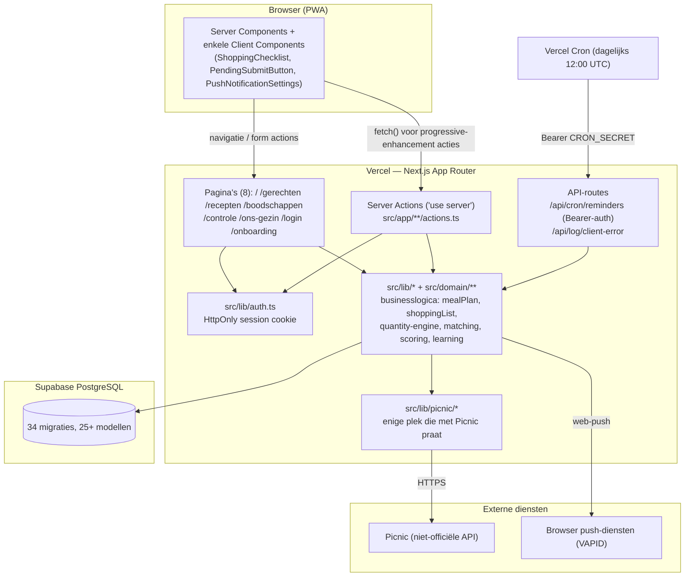

---

## 3. Alle schermen en routes

| Route | Doel | Belangrijkste componenten | Data gelezen | Data gewijzigd | Belangrijkste acties | Status |
|---|---|---|---|---|---|---|
| `/` | Weekmenu, eerstvolgende assistent-actie, leervragen | `page.tsx` (780 regels) | `Household`, `MealPlan`+`entries`, `Person`, `Preference`, `LearningPrompt`, attention-items | `MealPlanEntry`, `Preference`, `DayRoutine`, `FeedbackEvent`, `LearningPrompt` | Gerecht vervangen (link naar `/gerechten`), losse maaltijd invullen, daggewoonte instellen, leervraag beantwoorden, week opnieuw plannen | **Productierijp** |
| `/gerechten` | Gerecht kiezen/vervangen voor een specifieke dag, met wensveld | `page.tsx` (567 regels) | `RecipeVariant`+`Recipe` (globaal + eigen), `Preference`, `LearnedPattern` | `MealPlanEntry`, `Preference`, `FeedbackEvent`, `Recipe` (bij concrete wens) | Kiezen, vrije-tekstwens, dagfilter, verborgen gerecht herstellen | **Productierijp** |
| `/recepten` | Recepten-/ingrediënten-/productbeheer | `page.tsx` (680 regels) | `Recipe`, `RecipeIngredient`, `RecipeVariant`, `Ingredient`, `Product` | Alle bovenstaande + `HouseholdProductPreference`, `RejectedProductMatch` | Snel recept toevoegen, uitgebreid recept bewerken, ingrediënt/product beheren, recept verwijderen/kopiëren, zoeken | **Productierijp**, bewust secundair (progressive disclosure) |
| `/boodschappen` | Kernscherm: boodschappenlijst opbouwen, aanvullen, naar Picnic | `page.tsx` (1454 regels) + `ShoppingChecklist`, `AddToPicnicCart`, `PicnicTransfer`, `PicnicDeliveryStatusCard` | `ShoppingList`+`lines`, `FixedGrocery`, `InventoryItem`, live Picnic-zoekresultaten | `ShoppingListLine` (alle bronnen), `FixedGrocery`, `InventoryItem`, Picnic-mandje | Product toevoegen (eenmalig/vast), voorraad bijwerken, hoeveelheid aanpassen, afvinken, naar Picnic sturen, mandje legen | **Productierijp** |
| `/controle` | Productkeuzes controleren vóór bevestiging | `page.tsx` (584 regels) | `ShoppingListLine`+`product`, live Picnic-kandidaten | `ShoppingListLine`, `HouseholdProductPreference`, `RejectedProductMatch` | Bevestigen, ander product kiezen, alleen deze week, verwijderen, opnieuw zoeken | **Productierijp** |
| `/ons-gezin` | Gezinsbeheer + instellingen (secundair, progressive disclosure) | `page.tsx` (481 regels) + 9 subcomponenten | `Person`, `Preference`, `LearnedPattern`, `PicnicDeliveryPreference`, `PushSubscription`, `Household` | Vrijwel alle huishoud-/persoonsgebonden modellen | Gezinslid toevoegen/bewerken, voorkeuren, Picnic koppelen, bezorgmoment, meldingen, wachtwoord wijzigen | **Productierijp** |
| `/login` | Inloggen | `page.tsx` (klein) | — | `HouseholdSession` (bij succes) | Inloggen | **Productierijp** |
| `/onboarding` | Eerste installatie van een huishouden | `page.tsx` + `OnboardingWizard.tsx` (438 regels, client component) | — | `Household`, `Person`, `Preference`, `HouseholdSession` | 5-staps QUICK-wizard (DETAILED-modus bestaat als schema-waarde, **geen aparte, langere flow in de UI** — zie hieronder) | **Werkend maar beperkt** |
| `/api/cron/reminders` | Dagelijkse pushmeldingen-sweep | `route.ts` | Alle huishoudens + attention-items | `NotificationDeliveryLog`, `PushSubscription.disabledAt` | Geen gebruikersactie — Bearer-token-geauthenticeerd cron-endpoint | **Productierijp** (technisch) |
| `/api/log/client-error` | Ontvangt client-side foutrapportage | `route.ts` | — | Alleen een logregel (geen database-write) | Fire-and-forget vanuit `ErrorBoundaryScreen.tsx` | **Productierijp** (technisch, geen zichtbare UI) |
| `/manifest.webmanifest` | PWA-manifest | `manifest.ts` | — | — | Geen — Next.js-conventie | **Productierijp** |

**Bevinding — `/onboarding` DETAILED-modus**: `OnboardingWizard.tsx` en
`completeOnboarding` (`src/app/onboarding/actions.ts`) accepteren een
`onboardingMode: "QUICK" | "DETAILED"`-veld en slaan het op, maar een
gerichte lezing van `OnboardingWizard.tsx` laat zien dat de wizardstappen
zelf niet vertakken op deze modus — er is één vaste stappenreeks (modus,
gezinsnaam, gezinslid, weekritme, gebruikersnaam+wachtwoord). De
`PRODUCT_VISION.md`-belofte "8-12 lichte vragen" voor de DETAILED-route
bestaat dus niet als aparte flow. **Zeker** (wizardcode gelezen), dit is
een concreet, aantoonbaar gat tussen documentatie/schema-voorbereiding en
werkelijke UI — zie ook sectie 11.

**Verborgen/oude/redirect-routes**: geen gevonden. Geen `_middleware`,
geen ongebruikte routebestanden, geen debug-/beheerroutes buiten de
hierboven genoemde. `/api/cron/reminders` en `/api/log/client-error` zijn
de enige twee "technische" routes en zijn beide expliciet beveiligd of
ongevaarlijk (zie sectie 9).

**Laadgedrag**: één globale `src/app/loading.tsx` (skeleton met 5
placeholder-kaarten) dekt alle routes zonder eigen `loading.tsx` — geen
enkele subroute heeft een eigen loading-bestand (geverifieerd met
`find`). **Foutafhandeling**: `src/app/error.tsx` (root) + `src/app/
recepten/error.tsx` (pagina-specifiek, met eigen "Terug naar recepten"-
link) — beide client components die `ErrorBoundaryScreen` hergebruiken en
de fout fire-and-forget naar `/api/log/client-error` sturen. Overige
routes zonder eigen `error.tsx` vallen terug op de root-boundary (normaal
Next.js-gedrag voor geneste route-segmenten) — geen gat.

**Mobiele bruikbaarheid** (uit code afleidbaar, niet los in een browser
geverifieerd binnen deze audit): `viewportFit: "cover"` +
`env(safe-area-inset-bottom)` in zowel `layout.tsx` als `NavBar.tsx`,
vaste onderste navigatie met opzettelijk korte labels (code-comment
verwijst naar een eerder afknip-bug op 375-390px breedtes), PWA-manifest +
`appleWebApp`-metadata voor "Zet op beginscherm". **Waarschijnlijk** goed,
niet **zeker** zonder een echte devicetest.

---

## 4. Volledige functionaliteitenmatrix

Legenda "Bestaat": Ja / Gedeeltelijk / Alleen voorbereid / Nee.

### Account en toegang

| Functie | Bestaat | UI | Backend | Tests | Productiestatus | Opmerkingen |
|---|---|---|---|---|---|---|
| Login (gebruikersnaam+wachtwoord) | Ja | `/login` | `signInByCredentials` | Ja (e2e + WP77-scenario, niet als apart bestand) | Productierijp | Generieke foutmelding, geen username-enumeratie (WP62/77) |
| Logout | Ja | `/ons-gezin` | `logout()` | Indirect (e2e) | Productierijp | |
| Sessies | Ja | — | `HouseholdSession`, HttpOnly-cookie, 30 dagen | Nee (apart) | Productierijp | `secure` alleen in productie (bewust, voor lokale http-dev) |
| Gebruikersnamen (uniek) | Ja | onboarding + `/ons-gezin` | `username @unique`, genormaliseerd | `credentials.test.ts` | Productierijp | |
| Wachtwoorden | Ja | onboarding + `/ons-gezin` | SHA-256, householdId als salt, geen work factor | `credentials.test.ts` | **Werkend maar beperkt** | Zie sectie 9 — zwakke hashing |
| Household-toegang/autorisatie | Ja | — | `assertCurrentHousehold`, `requireCurrentHousehold` | Impliciet via elke actie-test + e2e | Productierijp op 90+ aanroepplekken | Twee uitzonderingen, zie sectie 9 |
| Household-isolatie | Gedeeltelijk | — | Consistent patroon, met 2 bevestigde gaten | `e2e/shoppingListAccess.e2e.ts` (1 scenario) | **Werkend maar beperkt** | Zie sectie 9 |
| Legacy single-household fallback | Ja | — | `getLegacySingleHousehold` | Nee | Productierijp, migratiepad | Zie sectie 9 voor de impliciete aanname |

### Gezin

| Functie | Bestaat | UI | Backend | Tests | Productiestatus | Opmerkingen |
|---|---|---|---|---|---|---|
| Huishouden | Ja | overal | `Household`-model | Overal impliciet | Productierijp | |
| Gezinsleden | Ja | `/ons-gezin` | `Person` | Impliciet | Productierijp | |
| Rollen (ouder/kind/overig) | Ja | `/ons-gezin` | `PersonRole` enum | Impliciet | Productierijp | Geen aparte maaltijdlogica per rol (zie sectie 13) |
| Voorkeuren (huishouden + persoon) | Ja | `/`, `/gerechten`, `/ons-gezin` | `Preference`-model, polymorf | Ja | Productierijp | |
| Harde beperkingen | Ja | onboarding, `/ons-gezin` | `Person.hardRestrictions` (vrije JSON-array van gecontroleerde tags) + `dietaryRestrictions.ts` | `dietaryRestrictions.test.ts` | Productierijp | Hard gefilterd, nooit als voorkeur behandeld (geverifieerd in `mealPlan.ts`) |
| Aanwezigheid per dag | Ja | `/ons-gezin` | `PersonPresenceOverride` | `presence.test.ts` | Productierijp | |
| Portiegrootte | Ja | `/ons-gezin` | `Person.portionMultiplier` | Impliciet via quantity-tests | Productierijp | |
| Kind vs. volwassene onderscheid in maaltijdkeuze | Alleen voorbereid | — | `VariantType.KID_FRIENDLY`, geen per-persoon-maaltijd | Nee | **Gedeeltelijk** | Eén gerecht per dag voor het hele huishouden (schema: `@@unique([mealPlanId, dayOfWeek])`) |

### Gerechten

| Functie | Bestaat | UI | Backend | Tests | Productiestatus | Opmerkingen |
|---|---|---|---|---|---|---|
| Recepten (globaal + huishouden) | Ja | `/recepten`, `/gerechten` | `Recipe`, `RecipeScope` | Impliciet | Productierijp | |
| Ingrediënten | Ja | `/recepten` | `Ingredient`, globaal gedeeld | Impliciet | Productierijp | Zie sectie 9 voor het isolatierisico |
| Categorieën | Ja | overal | `RecipeCategory` enum (8 waarden) | Impliciet | Productierijp | |
| Bereiding | Gedeeltelijk | `/recepten` (uitgeklapt) | `Recipe.instructions: String[]` | Nee | Werkend maar beperkt | Vrije tekstregels, geen stappen-timer o.i.d. |
| Porties | Ja | via `portionMultiplier` | Schaalt receptbehoefte | Ja (quantity-tests) | Productierijp | |
| Voorkeuren/uitsluitingen | Ja | zie "Gezin" | zie boven | Ja | Productierijp | |
| Zoeken | Ja | `/recepten`, `/gerechten` (wensveld) | server-side filter | Nee apart | Productierijp | |
| Kiezen/vervangen | Ja | `/gerechten` | `replaceMealPlanEntry` | Ja (e2e) | Productierijp | |
| Beoordelen | Ja | `/` (feedbackvraag) | `submitMealFeedback` | Impliciet | Productierijp | |
| Leren van gedrag | Ja | — | `recalculateVariantConfidence`, `hiddenRecipes.ts` | `hiddenRecipes.test.ts` | Productierijp | |
| Community-receptenlaag | Alleen voorbereid | Nee | `RecipeScope.COMMUNITY_CANDIDATE/APPROVED` bestaan als enum, **nergens toegekend** (geverifieerd met grep — 0 treffers buiten het schema/enum-lijst) | Nee | **Alleen technisch aanwezig** | Datamodel klaar, geen enkele promotieflow |

### Weekplanning

| Functie | Bestaat | UI | Backend | Tests | Productiestatus | Opmerkingen |
|---|---|---|---|---|---|---|
| Automatische generatie | Ja | `/` | `ensureMealPlan` (551 regels) | `mealPlan.test.ts` | Productierijp | |
| Handmatige planning | Ja | `/gerechten` | `replaceMealPlanEntry`, `chooseLiteralMealPlanEntry` | Ja (e2e) | Productierijp | |
| Meerdere suggesties | Ja | `/gerechten` | tot 12, gesorteerd op score | Nee apart | Werkend maar beperkt | Geen "3 per avond"-curatie, zie sectie 13 |
| Variatie binnen de week | Ja | — | `usedRecipeIds`-penalty in scoring | `scoreMealPlanCandidate.test.ts` | Productierijp | |
| Herhaling beperken | Ja | — | `daysAgo < 14`-penalty | Ja | Productierijp | Zachte score, geen harde 2-wekelijkse regel |
| Aanwezigheid meewegen | Ja | — | `getHouseholdHardRestrictionsAndParticipantsByDay` | Ja | Productierijp | |
| Aantal eters | Ja | — | `portionMultiplier`-som | Ja | Productierijp | |
| Weeknavigatie | Gedeeltelijk | `/` toont huidige week | `getCurrentWeekStart` | Nee | Werkend maar beperkt | Geen UI om een andere/toekomstige week te bekijken |
| Bevestigen | Ja | `/controle` → `confirmShoppingList` | `MealPlanStatus.GROCERIES_READY` | Ja | Productierijp | |
| Regenereren | Ja | `/` ("Week opnieuw plannen") | `regenerateCurrentWeekPlan` | `mealPlan.test.ts` (WP52-scenario) | Productierijp | |
| Vaste daggewoontes | Ja | `/` | `DayRoutine` | Impliciet | Productierijp | |
| Even/oneven-weekritme | Nee | — | — | — | **Niet gebouwd** | Zie sectie 13 |

### Boodschappen

| Functie | Bestaat | UI | Backend | Tests | Productiestatus | Opmerkingen |
|---|---|---|---|---|---|---|
| Lijstgeneratie uit weekmenu | Ja | `/boodschappen` | `ensureShoppingList` | Ja | Productierijp | |
| Vaste boodschappen | Ja | `/boodschappen` | `FixedGrocery` + `LineSource.FIXED` | `fixedGroceries.test.ts` | Productierijp | Zie sectie 9 voor 2 IDOR-gaten |
| Handmatige/eenmalige producten | Ja | `/boodschappen` | `LineSource.MANUAL`, `addManualProduct` | `shoppingList.test.ts`, e2e | Productierijp (WP82) | |
| Verwijderen | Ja | `/boodschappen`, `/controle` | diverse acties | Ja | Productierijp | |
| Afvinken | Ja | `/boodschappen` (checklist) | `pickedUpAt` | Nee apart (e2e-flow elders) | Productierijp | |
| Hoeveelheden | Ja | overal | quantity-engine | Uitgebreid getest | Productierijp | |
| Verpakkingseenheden | Ja | `/boodschappen`, `/controle` | `describeLinePackaging`, `isUserChosenPackageCount` | Ja, incl. WP82-regressietest | Productierijp | |
| Groepering (per dag/totaal) | Ja | `/boodschappen` | — | Nee | Productierijp | |
| Dubbele producten | Ja (voorkomen) | — | Upsert-patronen, `@@unique`-constraints | Ja | Productierijp | |
| Weekwissel (nieuwe lijst) | Ja | automatisch | `ensureShoppingList` per `MealPlan` | Ja | Productierijp | |
| Voorraadcorrecties | Ja | `/boodschappen` | `syncShoppingListForInventoryChange` | `inventory.test.ts` | Productierijp | |
| Tekort-detectie/vangnet | Ja | `/boodschappen` | `findShoppingListShortfalls` | Ja | Productierijp | |

### Picnic

| Functie | Bestaat | UI | Backend | Tests | Productiestatus | Opmerkingen |
|---|---|---|---|---|---|---|
| Authenticatie (koppelen, incl. 2FA) | Ja | `/ons-gezin` | `accountConnection.ts` | `accountConnection.test.ts` (7 tests) | Productierijp | |
| Product zoeken | Ja | `/boodschappen`, `/controle`, `/recepten` | `client.search`, `searchResults.ts` | Nee apart (via andere tests) | Productierijp | |
| Productmatching | Ja | — | `domain/product-matching/*` | `matchProduct.test.ts` | Productierijp | |
| Alternatieven kiezen | Ja | `/controle` | `rejectProductChoice`, `useProductThisWeekOnly` | Ja | Productierijp | |
| Hoeveelheden/verpakking | Ja | — | zie quantity-engine | Ja | Productierijp | |
| Winkelmand vullen | Ja | `/boodschappen` | `cartService.ts`, idempotent | `cartService.test.ts` | Productierijp | |
| Foutafhandeling (netwerk/API/2FA/timeouts) | Ja | `/boodschappen`, `/ons-gezin` | `PicnicNetworkError`/`PicnicApiError`/`Picnic2FARequiredError` | Ja (`client.test.ts`) | Productierijp | Eén automatische retry bij netwerkfout (WP62-vervolg) |
| Ontbrekende producten | Ja | `/controle` | aparte sectie "niet gevonden" | Ja | Productierijp | |
| Handmatige productkeuze | Ja | `/controle`, `/boodschappen` | zie boven | Ja | Productierijp | |
| Synchronisatie (bezorgmoment) | Ja | `/boodschappen`, `/ons-gezin` | `deliverySlots.ts`, `deliveryStatus.ts` | `deliverySlots.test.ts`, `deliveryStatus.test.ts` | Productierijp | Live check, geen opgeslagen "laatste status" (bewust) |
| Bestel-bevestiging (Picnic zelf) | Alleen voorbereid | `/boodschappen` ("Ik heb besteld") | `orderConfirmedAt`, puur optionele zelfbevestiging | Nee apart | Werkend maar beperkt | App kan een bestelling nooit zelf verifiëren (bewust, Fase 7/8-beperking) |

### Voorraad

| Functie | Bestaat | UI | Backend | Tests | Productiestatus | Opmerkingen |
|---|---|---|---|---|---|---|
| Voorraadregistratie | Ja | `/boodschappen` | `InventoryItem` | `inventory.test.ts` | Productierijp | |
| Aftrekken bij boodschappenlijst | Ja | — | `subtractInventory`, `ensureShoppingList` | Ja | Productierijp | |
| Toevoegen/status wijzigen | Ja | `/boodschappen` | `updateInventoryStatus` | Ja | Productierijp | |
| Houdbaarheid | Nee | — | — | — | **Niet gebouwd** | Alleen status (voldoende/bijna op/op/onbekend), geen datum |
| Voorraadadvies ("aandacht nodig") | Ja | `/boodschappen` | `needsInventoryAttention` (21-dagen-geldigheid) | Ja | Productierijp | |

### Leren en intelligentie

| Functie | Bestaat | UI | Backend | Tests | Productiestatus | Opmerkingen |
|---|---|---|---|---|---|---|
| Voorkeuren (expliciet) | Ja | overal | `Preference` | Ja | Productierijp | |
| Gedragshistorie | Ja | — | `FeedbackEvent` | Ja | Productierijp | |
| Feedback (expliciet) | Ja | `/`, `/gerechten` | `logFeedbackEvent` | Ja | Productierijp | |
| Scoringsalgoritmen | Ja | — | `scoreMealPlanCandidate.ts`, `matchProduct.ts` | Ja, uitgebreid | Productierijp | Deterministisch, geen `Math.random()` (zelf geverifieerd) |
| Productkeuzes (leren) | Ja | — | `HouseholdProductPreference`, confidence-ophoging | Ja | Productierijp | |
| Receptkeuzes (leren) | Ja | — | `recalculateVariantConfidence` | Ja | Productierijp | |
| Voorspellingen | Nee (in de sterke zin) | — | — | — | Niet gebouwd | Systeem scoort/rangschikt, doet geen aparte voorspelling (bijv. geen forecasting) |
| Expliciete vs. impliciete signalen | Ja | — | `PreferenceSource.EXPLICIT/INFERRED`, "stilte is feedback" (`silentAcceptance.ts`) | `silentAcceptance.test.ts` | Productierijp | |
| Patroonherkenning + leervragen | Ja | `/` | `LearnedPattern`, `LearningPrompt`, `patterns.ts` | `patterns.test.ts` (bestaat, zie testlijst) | Productierijp | Max. 2 vragen/sessie (`maxSmartQuestionsPerSession`) |
| Drie-keer-regel | Ja | — | `recordRepeatedMealReplacement`/`Acceptance` (3 signalen → prompt) | Ja | Productierijp | |

### Meldingen en overige modules

| Functie | Bestaat | UI | Backend | Tests | Productiestatus | Opmerkingen |
|---|---|---|---|---|---|---|
| Herinneringen (4 aandachtssituaties) | Ja | push + `/` | `attentionItems.ts`, `notifications.ts` | `attentionItems.test.ts`, `notificationPolicy.test.ts`, `notifications.test.ts` | Productierijp | |
| Pushmeldingen | Ja | `/ons-gezin` | service worker, VAPID, cron | Ja (integratie) | Werkend maar beperkt | `pushManager.subscribe()` faalt aantoonbaar in headless sandbox (gedocumenteerd, geen codefout) — **onzeker** of dit op een echt device altijd werkt zonder eigen VAPID-sleutels van de gebruiker |
| Bezorgmoment-melding | Ja | push | `getDeliverySlotNotificationCandidate` | `notifications.test.ts` | Productierijp | |
| Weer | Nee | — | — | — | **Niet gebouwd** | 0 treffers voor weer-specifieke termen in `src/` |
| Agenda | Nee | — | — | — | **Niet gebouwd** | "CalendarDays" is een decoratief icoon, geen functie |
| Afval | Nee | — | — | — | **Niet gebouwd** | |
| Verjaardagen | Nee | — | — | — | **Niet gebouwd** | |
| Administratie (buiten recepten/producten) | Nee | — | — | — | **Niet gebouwd** | |
| Activiteiten | Nee | — | — | — | **Niet gebouwd** | |

---

## 5. Datamodel

### ER-diagram (kernrelaties — niet elk enum/veld, wel elke tabel)

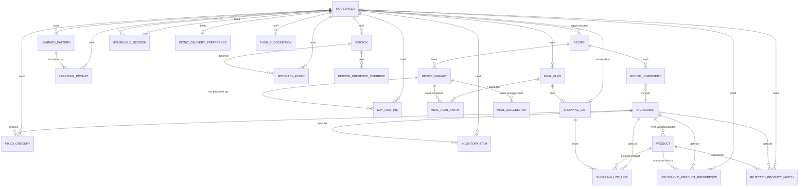

Niet in het diagram (los, geen sterke relatie of puur enum-drager):
`Preference` (polymorfe `ownerType/ownerId` + `subjectType/subjectId`,
géén Prisma `@relation` — zie schemacommentaar regel 3-5), `NotificationPreference`,
`NotificationDeliveryLog`.

### Modeltabel

| Model | Doel | Belangrijkste velden | Relaties | Gebruikt door | Risico's/opmerkingen |
|---|---|---|---|---|---|
| `Household` | Kernentiteit per gezin | `username`(uniek)/`passwordHash`, `picnicAuthToken`, `weeklyRhythm`(JSON), `onboardingMode`, `planningStyle` | 15+ relaties | overal | `picnicAuthToken` nooit naar client — geverifieerd |
| `DayRoutine` | Onthouden vaste daggewoonte | `dayOfWeek`, `recipeVariantId` | Household, RecipeVariant | `mealPlan.ts` | Schrijfpad (`setDayRoutine`) valideert recipeVariant-toegankelijkheid niet zelf, maar leespad (`ensureMealPlan`) is al scoped op `accessibleRecipeWhere` — **geen praktisch lek**, wel ontbrekende defense-in-depth (zeker, code gelezen) |
| `HouseholdSession` | Sessie-token-hash | `tokenHash`(uniek), `expiresAt` | Household | `auth.ts` | SHA-256 zonder salt, maar token zelf is 32 random bytes — acceptabel voor hoge-entropie geheimen |
| `FixedGrocery` | Vaste boodschap-standaard | `quantity`, `unit` | `@@unique([householdId, ingredientId])` | `fixedGroceries.ts` | — |
| `InventoryItem` | Voorraadstatus | `status` enum, optioneel `quantity/unit` | `@@unique([householdId, ingredientId])` | `inventory.ts` | Geen houdbaarheidsdatum (bewust, Fase 2: "geen complex magazijnsysteem") |
| `Person` | Gezinslid | `role`, `hardRestrictions`(JSON-array), `portionMultiplier` | Household, PersonPresenceOverride, FeedbackEvent | overal | `hardRestrictions` is vrije JSON, niet een FK naar een gecontroleerde tabel — vertrouwt op het gecontroleerde vocabulaire in `dietaryRestrictions.ts` |
| `PersonPresenceOverride` | Uitzondering op standaardaanwezigheid | `dayOfWeek`, `present` | `@@unique([personId, dayOfWeek])` | `presence.ts` | — |
| `Recipe` | Recept (globaal of huishouden) | `scope`, `householdId?`, `originHouseholdId?`, `promotedAt?`(ongebruikt) | Household(2×), RecipeIngredient, RecipeVariant | overal | `promotedAt` en `COMMUNITY_*`-scopes: schema klaar, **geen enkele schrijfplek** (grep bevestigd) |
| `RecipeIngredient` | Basisbehoefte per recept | `quantity`, `unit` | `@@unique([recipeId, ingredientId])` | mealPlan, shoppingList | — |
| `RecipeVariant` | Contextvariant van een recept | `variantType`, `ingredientOverrides`(JSON, **ongebruikt** — zie hieronder), `contextFit` | `@@unique([recipeId, variantType])` | scoring, planning | `ingredientOverrides` staat in het schema maar wordt (voor zover in deze audit gevonden) nergens gelezen bij het berekenen van receptbehoefte — mogelijk dode/voorbereide functionaliteit, **waarschijnlijk** (niet 100% uitgesloten dat een niet-gegrepte string-variant het veld raakt) |
| `MealPlan` | Eén week per huishouden | `weekStart`(Date), `status` | `@@unique([householdId, weekStart])` | overal | — |
| `MealPlanEntry` | Eén dag binnen een week | `source`, `status`, `reason`, `score`, `confidenceLevel`, `replacedFromRecipeVariantId` | `@@unique([mealPlanId, dayOfWeek])` | `/`, scoring, silentAcceptance | Eén gerecht per dag voor het HELE huishouden — geen per-persoon-maaltijd (zie sectie 4/13) |
| `MealSuggestion` | (Historisch/losstaand) suggestieregister | `reason`, `confidenceLevel`, `targetSlot` | Household, RecipeVariant | **beperkt** — WP52 verving de leesplek (`getReasonsForPlan`) door `MealPlanEntry.reason`; nog wel geschreven maar niet meer duidelijk gelezen buiten `regenerateCurrentWeekPlan`'s cleanup | **waarschijnlijk** grotendeels vervangen functionaliteit, niet met zekerheid dood (buiten scope om elke lezer te traceren) |
| `Ingredient` | Globale ingrediëntencatalogus | `name`(uniek), `restrictionTags`(String[]), `likelyInStock` | 6+ relaties | overal | **Geen household-scope — elk huishouden kan elk ingrediënt wijzigen, zie sectie 9** |
| `Product` | Winkelproduct (nu altijd Picnic) | `provider`, `externalRef`, `packageQuantity`, `price` | `@@unique([ingredientId, provider, externalRef])` | overal | Globaal gedeeld, geen household-scope (bewust, gedeelde catalogus — lager risico dan Ingredient omdat producten geen veiligheidsfunctie hebben) |
| `HouseholdProductPreference` | Onthouden productkeuze | `timesChosen`, `confidence`, `source` | `@@unique([householdId, ingredientId])` | matching | — |
| `RejectedProductMatch` | Afgewezen product | `reason?` | `@@unique([householdId, ingredientId, productId])` | matching | — |
| `ShoppingList` | Eén lijst per weekplan | `status`, `reviewFlaggedAt/reviewedAt/orderConfirmedAt` | `@unique mealPlanId` | overal | Geen `@updatedAt` bewust (comment: zou stale-klok resetten) |
| `ShoppingListLine` | Eén boodschappenregel | `source`(4 waarden), `quantity`, `unit`, `matchStatus/Confidence/Reasons`, `transferredToPicnicAt`, `shortfallAcknowledged`, `pickedUpAt` | Ingredient, Product?(optioneel) | de kern van `/boodschappen`/`/controle` | Rijkst geïnstrumenteerde model in het schema — 3 losstaande timestamp-velden voor 3 losstaande statussen (transfer/tekort/afgevinkt), goed gescheiden |
| `FeedbackEvent` | Gedragslog | `subjectType/subjectId`(polymorf), `eventType`, `reason?`, `context`(JSON) | Household, Person? | learning | `context` is vrije JSON — DATAMODEL_AUDIT.md noemt dit zelf al als "te vrij voor typed waarom-signalen" (nog steeds zo, geverifieerd) |
| `LearnedPattern` | Afgeleid gedragspatroon | `patternType`(3 waarden), `confidence`, `evidenceCount`, `status` | `@@unique([householdId, patternType, subjectType, subjectId, contextKey])` | `/`, `/ons-gezin` | Slechts 3 `LearnedPatternType`-waarden — smal t.o.v. wat `DATAMODEL_AUDIT.md` oorspronkelijk voorstelde |
| `LearningPrompt` | Openstaande leervraag | `promptType`(2 waarden), `status` | LearnedPattern? | `/` | Max. 2/sessie via `maxSmartQuestionsPerSession`, niet hard afgedwongen in het schema zelf (applicatielogica) |
| `Preference` | Voorkeur (huishouden of persoon) | `ownerType/ownerId`(polymorf, **geen FK**), `subjectType/subjectId`(polymorf), `stance`, `hiddenAt` | — (bewust geen Prisma-relatie, zie schemacomment) | overal, incl. dagvoorkeuren via samengestelde `ownerId` | Polymorfe integriteit is puur applicatie-afgedwongen — een verkeerd `ownerId` zou stil een niet-bestaand record kunnen "targeten" zonder foreign-key-fout. Niet aangetoond als exploitabel binnen deze audit, wel een architecturaal aandachtspunt |
| `PushSubscription` | Browserpush-abonnement | `endpoint`(uniek), `p256dh/auth`, `disabledAt` | Household | notifications | Nooit hard verwijderd bij falen (bewust, Fase 16) |
| `NotificationPreference` | Aan/uit per meldingstype | `enabled`(default true) | `@@unique([householdId, type])` | notifications | — |
| `NotificationDeliveryLog` | Dedupe-/auditlog | `dayKey`(string, Europe/Amsterdam) | Household | notifications | Bewust géén `@updatedAt`/UTC-afgeleide dag — voorkomt daggrens-bug |
| `PicnicDeliveryPreference` | Gewenst bezorgmoment | `preferredDayOfWeek/Time`, `windowMinutes`, `reminderDaysBefore` | `@unique householdId` | `/ons-gezin`, `/boodschappen`, notifications | — |

**Tenant-/household-isolatie**: overwegend sterk — vrijwel elk
household-gebonden model heeft ofwel een directe `householdId`-kolom met
`onDelete: Cascade`, ofwel is afleidbaar via een duidelijke relatieketen
(`ShoppingListLine` → `ShoppingList` → `MealPlan` → `Household`). De twee
globale, bewust gedeelde tabellen zijn `Ingredient` en `Product` — zie
sectie 9 voor het risico dat dit bij `Ingredient` oplevert.

**Cascadegedrag**: consistent `onDelete: Cascade` voor huishouden-eigendom
(bijv. `Person`, `FixedGrocery`, `InventoryItem`, `MealPlan`, alle
notificatiemodellen); `onDelete: SetNull` waar een verwijzing optioneel
mag worden (`MealPlanEntry.replacedFromVariant`,
`Recipe.originHousehold`); geen cascade op `Ingredient`/`Product` (terecht
— dit zijn gedeelde referentiedata, verwijderen zou meerdere huishoudens
raken, en er is ook geen enkele delete-actie voor `Ingredient` gevonden in
de hele codebase — **zeker**, geen `prisma.ingredient.delete` treffer).

**Week-/datumrepresentatie**: `MealPlan.weekStart` is `@db.Date` (geen
tijdcomponent), consistent met `getCurrentWeekStart()`
(`src/lib/week.ts`). Tijdgevoelige logica (pushvenster, bezorgmoment-
dagberekening) gebruikt bewust `Intl.DateTimeFormat`/`Europe/Amsterdam`
in plaats van servertijd (UTC op Vercel) — expliciet gedocumenteerd en
consistent toegepast in zowel `notificationPolicy.ts` als
`deliverySlots.ts`.

**Hoeveelheden/eenheden**: `Unit` enum heeft slechts 3 waarden (`GRAM`,
`PIECE`, `ML`) — geen aparte `KG`/`L`, die conversie gebeurt puur in
`src/lib/quantity/units.ts`. Consistent overal toegepast.

**Soft/hard delete**: doorgaans hard delete (`prisma.X.delete`), met één
bewuste "soft"-achtige uitzondering: `Preference.hiddenAt` (gerecht
verbergen is een veld-update, geen delete) en `PushSubscription.disabledAt`
(nooit hard verwijderd bij een mislukte push). Verder geen soft-delete-
patroon in het schema.

**Ongebruikte/dubbele/verouderde velden** (zelf geverifieerd, niet alleen
uit documentatie overgenomen):
- `Recipe.imageUrl`/`imageAttribution`/`imageSourceUrl`: **zeker
  ongebruikt** in de huidige UI — grep op deze drie veldnamen buiten
  `recepten/actions.ts`' eigen (nog werkende, want het veld accepteert nog
  steeds waarden bij `copyRecipeToHousehold`) leesplekken levert geen
  enkele render-plek op. `PROGRESS.md` bevestigt dit zelf als bewuste
  keuze (foto-functie verwijderd, veld bewust laten staan).
  `Recipe.promotedAt`: **zeker** nergens geschreven (grep, 0 treffers
  buiten schema/generated client).
- `RecipeVariant.ingredientOverrides`: **waarschijnlijk** ongebruikt bij
  het berekenen van daadwerkelijke receptbehoefte (niet 100% sluitend
  uit te sluiten zonder elke aanroeper van `RecipeIngredient` te
  herleiden, maar geen directe lezer gevonden in `mealPlan.ts` of
  `shoppingList.ts`).
- `MealSuggestion`: zie tabel hierboven — **waarschijnlijk** grotendeels
  overbodig geworden sinds WP52, nog wel geschreven.

---

## 6. De hersenen van de app

### Gerechtselectie — `chooseMealPlanCandidate` (`src/domain/meal-planning/scoreMealPlanCandidate.ts:308-316`)

- **Kandidaten**: alle `RecipeVariant`s van toegankelijke recepten
  (`accessibleRecipeWhere`) die de harde filters al gepasseerd zijn
  (aangeleverd door de aanroeper, `ensureMealPlan`).
- **Harde beperkingen**: worden **vóór** deze functie toegepast in
  `ensureMealPlan` (`src/lib/mealPlan.ts`) via
  `recipeConflictsWithRestrictions` + `NEVER`-voorkeuren + verborgen
  gerechten (`hiddenRecipes.ts`) — nooit binnen de scorefunctie zelf.
  **Zeker**, code gelezen (regels 320-333 in `mealPlan.ts`).
- **Zachte voorkeuren**: 12+ afzonderlijke signalen, elk met eigen gewicht
  (zie code hierboven, regels 157-298): druktedag-fit (±25), categorie-
  voorkeur (±20/8), bevestigde dag-categoriepatronen (+18×confidence),
  variant-voorkeur (±20/25/60), dag-receptvoorkeur (±40/18/28), persoonlijke
  voorkeuren per persoon/categorie/ingrediënt (±10..120), receptstatus
  (+10/15), planningsstijl (±14/12/8/6), kindvriendelijkheid (+8), recentheid
  (-20 bij <14 dagen, +8 bij ≥35 dagen, +4 bij nooit gepland), en een
  -50-penalty als het recept deze week al een keer gekozen is.
- **Score**: som van bovenstaande, startend op 100.
- **Willekeur**: **geen** — sortering is `score DESC`, tiebreak op
  `candidate.id.localeCompare` (regel 315). Zelf geverifieerd, geen
  `Math.random()` in dit bestand of `mealPlan.ts`.
- **Herhaling**: `usedRecipeIds`(binnen dezelfde week) én `lastPlannedAt`
  (over weken heen, 14-dagen-penalty) — twee aparte mechanismen.
- **Gezinsleden**: `personalVariantPreferences`/`personalCategoryPreferences`/
  `personalIngredientPreferences`, elk met eigen naam in de uitlegtekst.
- **Aantal personen**: niet in de scorefunctie zelf — telt mee bij de
  hoeveelhedenberekening (`getHouseholdPortionScaleByDay`), niet bij de
  gerechtkeuze.
- **Eerdere keuzes**: `lastPlannedByRecipeId` (Map, per recept de laatste
  keer dat het gepland is).
- **Vervangen**: `replaceMealPlanEntry` (`src/app/gerechten/actions.ts:50-181`)
  — herhaalt dezelfde harde controles server-side (met een expliciete
  code-comment die uitlegt waarom: "server actions zijn een publiek
  bereikbaar POST-endpoint").

### Weekplanning — wanneer een plan wordt (her)gebruikt

`ensureMealPlan(householdId, weekStart)` (`src/lib/mealPlan.ts`) zoekt
eerst een bestaand `MealPlan` voor die `(householdId, weekStart)`-combinatie
(uniek in het schema); bestaat het, dan wordt het **hergebruikt**, niet
opnieuw gegenereerd — nieuwe generatie gebeurt alleen bij een nieuwe week of
expliciete `regenerateCurrentWeekPlan`. Een race tussen twee bijna-
gelijktijdige aanvragen wordt opgevangen via Prisma-foutcode `P2002` (WP59
— eerst een echte, in e2e-tests gevonden bug, nu gefixt en van een
regressietest voorzien in de commit-geschiedenis, al niet meer als los
testbestand aanwezig in de huidige testlijst — **waarschijnlijk** nog
steeds gedekt via het algemene `mealPlan.test.ts`, niet apart
geverifieerd in deze audit).
Elke dag wordt **onafhankelijk** gekozen (`for`-lus per `DayKey` in
`ensureMealPlan`), met `usedRecipeIds` als enige weekbrede state die
overloopt tussen dagen — dit is de enige weekbrede variatiemaatregel.
Er is geen aparte "hele week in één keer optimaliseren"-stap.

### Hoeveelheden — `src/lib/quantity/*`

- **Porties**: `portionMultiplier` per persoon, opgeteld tot een
  dag-schaalfactor (`getHouseholdPortionScaleByDay`, `src/lib/household.ts`).
- **Eenheden**: `units.ts` (GRAM/PIECE/ML, met conversiehelpers).
- **Afronding**: `safeCeilDivision` (`packages.ts:35-39`) — rondt altijd
  naar boven af, met expliciete bescherming tegen floating-point-ruis
  (`0.3/0.1`-voorbeeld in de code-comment).
- **Verpakkingen**: `calculatePackageRequirement` (zie sectie 8 voor het
  PROJECT_BLUEPRINT.md-voorbeeld dat exact hierin terugkomt).
- **Handmatig gekozen aantallen**: `isUserChosenPackageCount`
  (`src/lib/shoppingList.ts`) — FIXED/MANUAL-regels met `unit: PIECE`
  slaan de verpakkingsengine bewust over (dit was de bron van de WP82-bug,
  nu gefixt en op 5 plekken consistent toegepast — geverifieerd met grep).
- **Vaste boodschappen**: eigen upsert-pad (`upsertFixedGrocery`), los van
  de receptgedreven aggregatie.
- **Edge cases expliciet getest** (zie `packages.test.ts`,
  `parsePackageSize.test.ts`, `units.test.ts`, `inventory.test.ts`): kleiner
  dan één verpakking, exact één, net iets meer, ontbrekende verpakking
  (`PACKAGE_UNKNOWN`-status i.p.v. gok), decimalen, stuks.

### Boodschappen — opbouw en samenvoeging

`ensureShoppingList` (`src/lib/shoppingList.ts`) bouwt de lijst op uit drie
bronnen (`MEAL`, `FIXED`, `INVENTORY`) plus de losse `MANUAL`-toevoegingen;
wordt **niet** blind herbouwd bij elk paginabezoek — bestaande regels
blijven staan tenzij het weekmenu zelf verandert (`invalidateShoppingList`
wordt gericht aangeroepen vanuit acties die het menu wijzigen, niet
automatisch bij elk bezoek). Dubbele `MEAL`-regels voor hetzelfde
ingrediënt worden samengevoegd via `aggregateMealNeeds` (gedeeld tussen
`ensureShoppingList` en `findShoppingListShortfalls` — bewust dezelfde
functie, om drift tussen "wat de lijst toont" en "wat het tekortvangnet
berekent" te voorkomen). Handmatige regels (`MANUAL`) worden nooit
automatisch samengevoegd — bewust altijd een nieuwe regel per toevoeging
(zie sectie 4). Verwijderde regels komen niet vanzelf terug totdat de
onderliggende reden (menu/voorraad) opnieuw getriggerd wordt.

### Picnic-productkeuze — `matchProduct` (`src/domain/product-matching/matchProduct.ts`)

Zie sectie 2/8 voor het volledige beslispad: `NOT_FOUND` → vertrouwde
keuze (indien nog beschikbaar) → `UNAVAILABLE` (indien de vertrouwde keuze
niet meer beschikbaar is — expliciet, geen stille aanname) → enige
beschikbare kandidaat (`MATCHED_TRUSTED`, confidence 0.8) → gescoorde
keuze tussen meerdere kandidaten (`MATCHED_REVIEW_REQUIRED`, altijd
review nodig, nooit automatisch vertrouwd). Score houdt rekening met
`productChoicePreference` (LOW_PRICE/KNOWN_PACKAGE/BALANCED), beschikbaar-
heidsvenster (30 dagen sinds `lastSeenAvailable`), en genereert per-
kandidaat verschillende redenen (niet één herhaalde huishoudinstelling —
expliciet als UX-fix gedocumenteerd in WP "UX WP2").

### Leren

- **Opgeslagen acties**: `FeedbackEvent` (elke CHOSEN/REPLACED/IGNORED/
  EXPLICIT_FEEDBACK/RESTORED), inclusief stille acceptatie
  (`silentAcceptance.ts` — CHOSEN met `context.source: "silent_week_acceptance"`).
- **Beoordelingen**: ja, `EXPLICIT_FEEDBACK` met `context.positive`.
- **Vervangingen geïnterpreteerd**: ja, met een typed `FeedbackReason`
  (11 waarden) — niet vrije tekst.
- **Automatisch aangepaste voorkeuren**: ja, `recalculateVariantConfidence`
  (`src/lib/scoring.ts`) leest recente `FeedbackEvent`s en past
  `Preference.stance/confidence` aan; `hiddenRecipes.ts` verbergt een
  gerecht pas na **twee of meer** zwaarwegende negatieve signalen sinds de
  laatste keer herstellen (niet bij één, consistent met
  `PRODUCT_VISION.md`).
- **Alleen infrastructuur, of ook echt lerend gedrag?** **Echt lerend
  gedrag**, niet alleen infrastructuur — bevestigd door de aanwezigheid van
  daadwerkelijke scorewijzigingen op basis van historische data
  (`recalculateVariantConfidence`, `LearnedPattern`-drempels) en het feit
  dat dit end-to-end getest is (`hiddenRecipes.test.ts` bevestigt bijv.
  dat een verborgen gerecht ook als vaste daggewoonte genegeerd wordt).
- **AI, heuristiek, scoring, of vaste regels?** Uitsluitend **heuristische
  scoring met vaste, uitlegbare gewichten** — geen extern LLM/ML-model,
  geen embeddings, geen enkele aanroep naar een AI-API voor deze logica
  (geverifieerd: geen OpenAI/Anthropic/ML-library in `package.json`
  buiten wat voor deze audit-sessie zelf gebruikt wordt).

### Beslisdiagram — weekplanning voor één dag

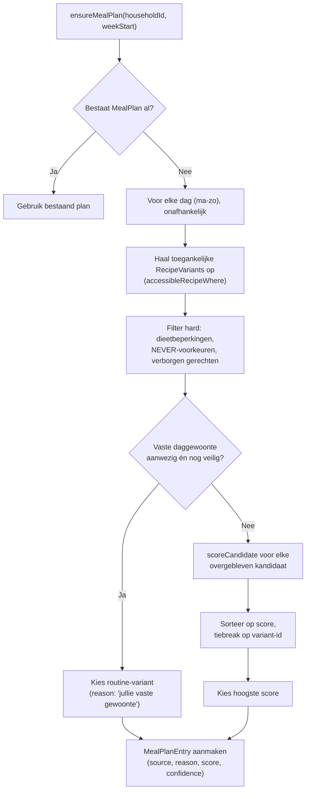

### Beslisdiagram — productmatch per boodschappenregel

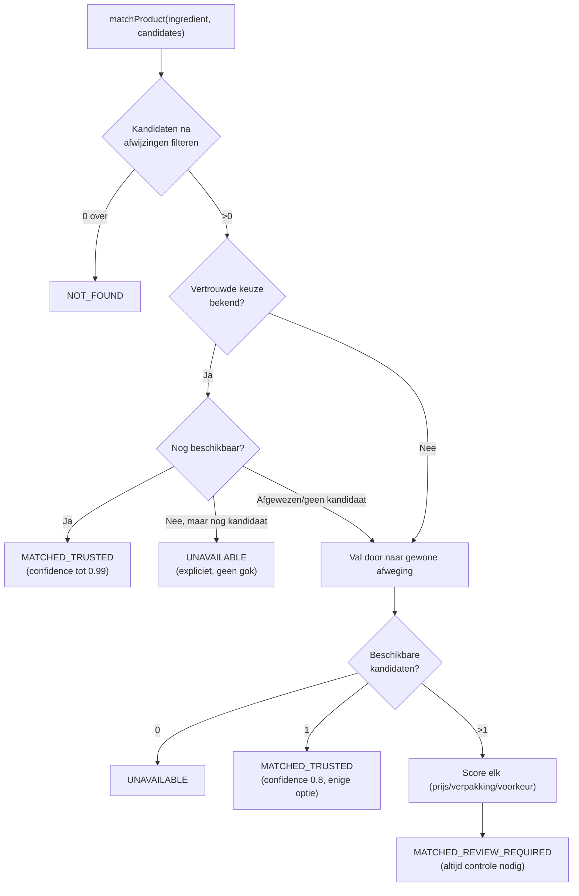

### Overzicht per beslisfunctie

| Functie | Bestand | Input | Output | Afhankelijkheden | Tests | Bekende beperkingen |
|---|---|---|---|---|---|---|
| `chooseMealPlanCandidate` | `src/domain/meal-planning/scoreMealPlanCandidate.ts` | Kandidatenlijst + voorkeuren/patronen/planningsstijl | Beste kandidaat + score + redenen | Geen (pure functie) | `scoreMealPlanCandidate.test.ts` (352 regels) | Geen weekbrede optimalisatie, alleen per-dag + running `usedRecipeIds` |
| `matchProduct` | `src/domain/product-matching/matchProduct.ts` | Kandidaten + vertrouwde voorkeur + afwijzingen | Match + status + confidence + redenen | Geen (pure functie) | `matchProduct.test.ts` | 30-dagen-beschikbaarheidsvenster is een vaste aanname, geen live Picnic-check per match |
| `calculatePackageRequirement` | `src/lib/quantity/packages.ts` | Receptbehoefte, voorraad, verpakkingsgrootte | Status + aantal verpakkingen + surplus | `subtractInventory` | `packages.test.ts` | Gooit een Error bij eenheid-mismatch (bewust, geen stille conversie) |
| `deriveHiddenState` | `src/domain/learning/hiddenRecipes.ts` | Recente feedback-events | Wel/niet verbergen | Geen | `hiddenRecipes.test.ts` (8 tests) | Alleen 2 van de 11 `FeedbackReason`-waarden tellen mee (bewust, "smaak" i.p.v. context) |
| `selectNotificationToSend` | `src/domain/attention/notificationPolicy.ts` | Attention-items + voorkeuren + huidige tijd | Welke melding (indien) | `isWithinNotificationWindow`, `notificationDayKey` | `notificationPolicy.test.ts` (14 tests, incl. zomer-/wintertijd) | Max. 1 per huishouden per dag — kan een tweede, urgentere situatie diezelfde dag maskeren (bewust) |

---

## 7. Gebruikersflows

### 1. Eerste gebruik

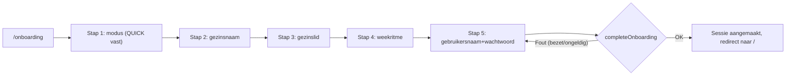
Benodigde voorkennis: geen. Stappen: 5 (vast, DETAILED-modus bestaat niet
als aparte flow — zie sectie 3). Blokkade: bezette gebruikersnaam (netjes
afgevangen, geen half aangemaakt huishouden — geverifieerd in
`completeOnboarding`). Geen dode paden gevonden.

### 2. Inloggen

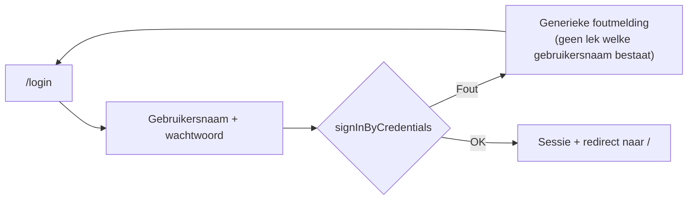
1 stap. Geen blokkades buiten een fout wachtwoord/gebruikersnaam (bewust
generiek).

### 3. Weekplanning openen

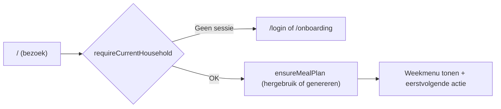

### 4. Gerecht kiezen/vervangen

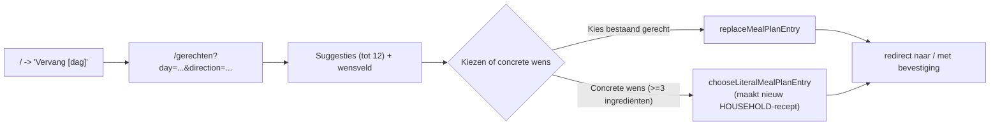
Mogelijke blokkade: harde beperking/persoonlijke NEVER-voorkeur → foutmelding
i.p.v. stille afwijzing (server-side herhaald gecontroleerd, zie sectie 6).

### 5. Boodschappenlijst genereren

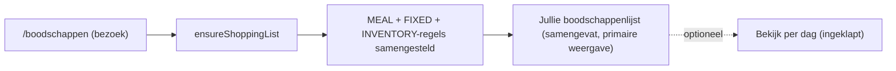

### 6. Handmatig product toevoegen

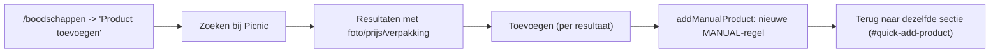

### 7. Vaste boodschap toevoegen

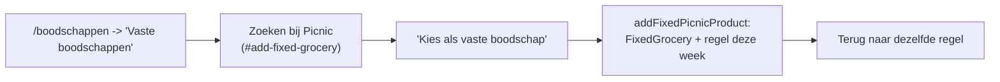

### 8. Product afvinken

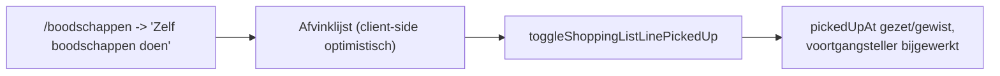

### 9. Picnic-product kiezen

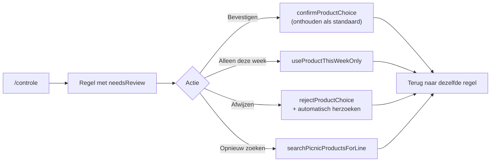

### 10. Boodschappen naar Picnic sturen

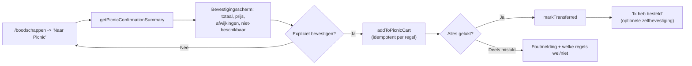
Belangrijk: dit vult het mandje, maar **bestelt nooit automatisch** —
consistent met `PRODUCT_VISION.md` regel 10 en `PROJECT_BLUEPRINT.md` Fase 8.

### 11. Gezinslid/voorkeur aanpassen

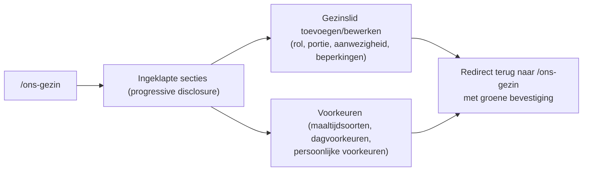

### 12. Uitloggen en opnieuw inloggen

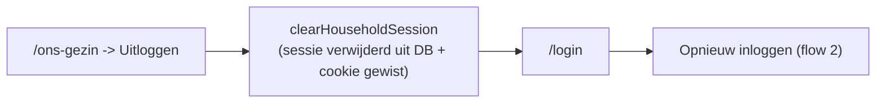

**Technisch mogelijk vs. logisch vindbaar vs. prettig bruikbaar**: de
kernflow (1 → 3 → 4 → 5 → 9 → 10) is alle drie — bevestigd doordat
`e2e/criticalFlow.e2e.ts` precies deze keten end-to-end doorloopt zonder
handmatige workarounds. Minder vindbaar/prettig: de DETAILED-onboarding
(bestaat niet echt, sectie 3), en weeknavigatie (geen manier om een
toekomstige of vorige week te bekijken — alleen de huidige). Geen
dubbele handelingen of dead ends gevonden in de hierboven gereconstrueerde
flows; elke actie eindigt met een zichtbare bevestiging (consistent
patroon sinds de in `PROGRESS.md` gedocumenteerde "bevestiging bij elke
opslagactie"-sweep).

---

## 8. Test- en kwaliteitsniveau

### Inventarisatie

- **Unit-/integratietests**: 32 bestanden (`find src -name "*.test.ts"`),
  gemengd pure unit tests en Postgres-integratietests in dezelfde
  bestanden (geen aparte map-scheiding) — consistent met `OPERATIONS.md`'s
  beschrijving.
- **End-to-end**: 2 bestanden (`e2e/criticalFlow.e2e.ts`,
  `e2e/shoppingListAccess.e2e.ts`) + 3 fixture-bestanden
  (`mockPicnicServer.ts`, `testServer.ts`, `testHousehold.ts`).
- **Mocks**: een eigen lichte HTTP-mock-Picnic-server (geen library als
  `msw`) voor e2e; voor unit-/integratietests wordt Picnic meestal
  gemockt via een geïnjecteerde `fetch`-fake (bijv.
  `accountConnection.test.ts`, `notifications.test.ts`).
- **Testdatabase**: een echte lokale Postgres, geen Prisma-mocking voor
  integratietests — bewuste keuze (`OPERATIONS.md`).
- **Seedafhankelijkheid**: een deel van de integratietests verwacht
  bestaande, geseede data (bijv. "kipfilet") — expliciet gedocumenteerd
  risico, ooit misgegaan in de eerste CI-proefdraai (WP80).
- **CI**: `.github/workflows/ci.yml` — Postgres-service, migreren, seeden,
  `npm run verify`. Geen e2e in CI (bewuste, gedocumenteerde trade-off).
- **Lint**: ESLint 9 (`eslint-config-next`).
- **Typecheck**: `tsc --noEmit`, strict.
- **Build**: onderdeel van `npm run verify`.

### In deze audit daadwerkelijk uitgevoerde checks

Alle onderstaande commando's zijn in deze sessie uitgevoerd, read-only ten
opzichte van de repository (wel tegen een lokale, voor deze sandbox eigen
Postgres-instantie — geen repositorybestand is aangeraakt, zie sectie 16).

| Commando | Resultaat | Duur | Details |
|---|---|---|---|
| `npx eslint .` | **Geslaagd**, 0 meldingen | ~30s | |
| `npx tsc --noEmit` | **Geslaagd**, 0 fouten | ~6s | |
| `npm test` | **250/250 geslaagd**, 0 gefaald | ~41s (na Postgres-start; eerste poging zonder draaiende Postgres gaf 49 valse "failures" — geen echte testbugs, zie hieronder) | `# tests 250 / # pass 250 / # fail 0` |
| `npm run build` (incl. `prisma migrate deploy`) | **Geslaagd** — "No pending migrations to apply", alle 11 routes gecompileerd | ~35s | Bevestigt dat het lokale schema exact overeenkomt met de 34 migraties |
| `npx prisma migrate diff` (drift-check) | **Geen onverwachte drift** — alleen de twee al in `OPERATIONS.md` gedocumenteerde, cosmetische `RENAME INDEX`-regels | <5s | Exact zoals `OPERATIONS.md` voorspelt sinds WP60 |
| `npm run test:e2e` | **13/13 geslaagd** (beide bestanden, serieel) | ~66s | Kritieke flow (9 subtests) + household-isolatie-regressietest (2 subtests) |

**Kanttekening bij `npm test`'s eerste poging**: de lokale PostgreSQL-
dienst stond bij de start van deze audit-sessie niet aan (afzonderlijke,
verse sandbox-container). Dit gaf 49 gefaalde integratietests met een
duidelijke, herkenbare oorzaak (verbindingsfout), geen inhoudelijke
testbugs. Na `sudo service postgresql start` (een lokale dienst starten,
geen bestandswijziging) waren alle 250 tests groen. Dit is exact het
gedrag dat `OPERATIONS.md` voorspelt en is dus zelf een bevestiging van de
documentatie, geen nieuwe bevinding.

**Niet uitgevoerd**: een handmatige devicetest (fysieke telefoon, echte
Picnic-account, echte pushmeldingen-ontvangst) — dit vereist middelen
(een live Picnic-account, een fysiek toestel) die buiten het bereik van
een read-only coderepository-audit vallen. Zie sectie 15 ("Eerst
valideren") voor wat de product owner hiervoor zelf zou moeten doen.

### Welke domeinen zijn goed getest?

Quantity-/verpakkingsengine (5 testbestanden, dekt exact de PROJECT_BLUEPRINT.md-
scenario's), productmatching, weekplan-scoring (352 regels aan tests, het
grootste testbestand naast de test-infrastructuur), Picnic-
foutafhandeling (`client.test.ts`), household-isolatie voor de MANUAL/
FIXED-toevoegflow (specifiek `e2e/shoppingListAccess.e2e.ts`),
pushmeldingenbeleid (incl. zomer-/wintertijdgrenzen).

### Welke cruciale domeinen zijn nauwelijks getest?

- **De twee IDOR-gaten uit sectie 9 hebben geen enkele test** — noch een
  test die het gat aantoont, noch een die het (onterecht) als "veilig"
  bevestigt. Dit is precies waarom `e2e/shoppingListAccess.e2e.ts` één
  scenario dekt maar niet het volledige patroon herhaalt voor
  `addFixedGrocery`/`removeFixedGroceryPermanently`.
- **`Ingredient`-isolatie** (sectie 9, bevinding 3): geen enkele test
  controleert dat een huishouden geen ingrediënten van een ander
  huishouden kan corrumperen — logisch, want dit is per ontwerp een
  gedeelde tabel, maar de *veiligheidsimplicatie* voor allergiefiltering
  is nergens getest.
- **Wachtwoordsterkte/-opslag**: `credentials.test.ts` test normalisatie en
  vormvalidatie, niet de cryptografische sterkte van de hash zelf (logisch
  — dat is geen testbaar "gedrag", wel een architecturale keuze, zie
  sectie 9).
- **Weeknavigatie** (bekijken van een andere week dan de huidige): bestaat
  niet, dus ook niet getest — geen bug, wel een leemte.
- **`DETAILED`-onboarding**: geen enkele test dekt dit pad, want de UI-
  vertakking bestaat niet (sectie 3).

### Kwetsbare/te implementatiespecifieke tests

Niet systematisch aangetroffen bij deze audit — de gelezen tests
(quantity, matching, scoring, hiddenRecipes) toetsen op observeerbaar
gedrag/output, niet op interne implementatiedetails. Eén aandachtspunt:
`e2e/criticalFlow.e2e.ts` en `e2e/shoppingListAccess.e2e.ts` draaien elk
hun eigen volledige `next build` (bevestigd in `e2e/fixtures/
testServer.ts`) — dit maakt de suite robuust maar ook traag (66s voor 13
subtests); dit was zelf al de bron van een eerder gevonden en gefixte
hang-bug (WP82-vervolg, concurrency + `next build` naar dezelfde `.next`-
map), nu opgelost met `--test-concurrency=1`.

### Tenantisolatie, verpakkingslogica, authenticatie, Picnic-fouten,
end-to-end — worden deze getest?

Ja voor alle vijf, met de kanttekening dat tenantisolatie **niet volledig**
gedekt is (zie hierboven — twee bevestigde gaten zonder test).
Verpakkingslogica: uitgebreid getest (packages/units/parsePackageSize/
inventory, plus de WP82-regressietest voor `isUserChosenPackageCount`).
Authenticatie: getest via `credentials.test.ts` + het e2e-scenario uit
WP77 (niet meer als los bestand aanwezig, wel in de commit-historie
beschreven — **waarschijnlijk**, niet in deze audit herverifieerd als los
scenario). Picnic-fouten: `client.test.ts`, `accountConnection.test.ts`,
`deliveryStatus.test.ts`. End-to-end: ja, de kritieke flow uit Fase 15 is
volledig gedekt.

---

## 9. Beveiliging en gegevensisolatie

Methode: elke `"use server"`-actie is gelezen (15 bestanden, ~90
aanroepen van `assertCurrentHousehold`/`requireCurrentHousehold`/
`assertShoppingListAccess`), met specifieke aandacht voor het patroon
"een los meegestuurd ID wordt vertrouwd zonder de eigenlijke eigenaar
opnieuw af te leiden" — precies het patroon dat de `code-reviewer`-
subagent al één keer eerder vond (WP82-vervolg). Twee nieuwe, tot nu toe
niet gedocumenteerde instanties van datzelfde patroon zijn gevonden.

### Bevinding 1 — IDOR: `addFixedGrocery` kan een regel in een ANDER huishouden schrijven

> **Opgelost — WP83 (2026-07-31).** `addFixedGrocery` roept nu eerst
> `assertShoppingListAccess(shoppingListId)` aan (zelfde bewezen patroon als
> `addFixedPicnicProduct`) vóór er iets geschreven wordt. Bevestigd via een
> nieuw e2e-aanvalsscenario in `e2e/shoppingListAccess.e2e.ts`, met
> revert-en-bevestig geverifieerd. Zie `PROGRESS.md` WP83.

**Ernst: Hoog.**
**Bestand**: `src/app/boodschappen/fixedGroceriesActions.ts:206-232`.
**Bewijs**:
```
export async function addFixedGrocery(formData: FormData) {
  const householdId = String(formData.get("householdId"));
  await assertCurrentHousehold(householdId);      // bewijst alleen: householdId hoort bij mijn sessie
  const ingredientId = String(formData.get("ingredientId"));
  const quantity = parseQuantity(formData.get("quantity"));
  const unit = parseUnit(formData.get("unit"));
  const shoppingListId = formData.get("shoppingListId");   // NIET geverifieerd

  await upsertFixedGrocery(householdId, ingredientId, quantity, unit);  // veilig — scoped op householdId

  if (shoppingListId) {
    const match = await matchProductForIngredient(householdId, ingredientId);
    const line = await prisma.shoppingListLine.create({
      data: { shoppingListId: String(shoppingListId), ... },  // schrijft in ELKE shoppingListId
      ...
    });
```
Dit is exact hetzelfde patroon dat de `code-reviewer`-subagent al vond in
`addFixedPicnicProduct` en `addBulkFixedPicnicProducts` in **hetzelfde
bestand** (zie de code-comments op regel 254-258 en 350-352, die letterlijk
uitleggen waarom dit gevaarlijk is) — maar de fix (`assertShoppingListAccess`)
is niet ook op deze functie toegepast. `PROGRESS.md`'s WP82-vervolg-rij
noemt zelfs expliciet: *"Bewust niet meegenomen: `addFixedGrocery` (zelfde
bestand) heeft hetzelfde onbeveiligde patroon maar viel buiten wat de
reviewer aanmerkte."* Dit is dus een **bekend, gedocumenteerd, maar nog
niet opgelost gat**, geen nieuwe ontdekking van het onderliggende
probleem — wel een nieuwe, expliciete bevestiging dat het nog leeft.
**Faalscenario**: een sessie van huishouden A stuurt een POST naar deze
actie met een geldig eigen `householdId`, een willekeurig bekend
`ingredientId` (ingrediënten zijn globaal, dus altijd raadbaar/bekend) en
een geraden/gelekte `shoppingListId` van huishouden B → er verschijnt een
onverwachte boodschappenregel in B's lijst.
**Zekerheid**: zeker (code gelezen, patroon identiek aan een al bevestigd
en elders gefixt scenario met een eigen e2e-regressietest).

### Bevinding 2 — IDOR: `removeFixedGroceryPermanently` kan een regel van een ANDER huishouden verwijderen

> **Opgelost — WP83 (2026-07-31).** Verifieert nu eerst eigenaarschap via
> `loadFixedLine(lineId)` (dezelfde helper als de rest van dit bestand)
> vóór de delete; de twee gekoppelde deletes (`fixedGrocery` +
> `shoppingListLine`) zijn samengevoegd in één `prisma.$transaction([...])`.
> Bevestigd via een nieuw e2e-aanvalsscenario, revert-en-bevestig
> geverifieerd. Zie `PROGRESS.md` WP83.

**Ernst: Hoog.**
**Bestand**: `src/app/boodschappen/fixedGroceriesActions.ts:374-385`.
**Bewijs**:
```
export async function removeFixedGroceryPermanently(formData: FormData) {
  const householdId = String(formData.get("householdId"));
  await assertCurrentHousehold(householdId);
  const ingredientId = String(formData.get("ingredientId"));
  const lineId = formData.get("lineId");

  await removeFixedGrocery(householdId, ingredientId);   // veilig
  if (lineId) {
    await prisma.shoppingListLine.deleteMany({ where: { id: String(lineId), source: "FIXED" } });
    // GEEN householdId/shoppingList-eigenaarschapscontrole op deze specifieke lineId
  }
```
**Faalscenario**: dezelfde soort aanval als hierboven, maar dan een
**delete** — potentieel schadelijker dan een ongewenste extra regel. Het
`lineId` is weliswaar een UUID (niet te raden), maar het is **niet
geheim**: dezelfde `fixedGroceriesActions.ts` zet `lineId` zelf zichtbaar
in de URL na elke actie (`redirectToFixedLine`, bijv.
`/boodschappen?fixedLine=<uuid>#fixed-line-<uuid>`) — een gedeelde link,
browserhistorie, of een schouder-kijkend gezinslid van een ander
huishouden zou dit kunnen zien. Er is dus geen sterke defense-in-depth via
"UUID's zijn toch niet te raden".
**Zekerheid**: zeker (code gelezen; het ontbreken van de check is
onmiskenbaar t.o.v. het patroon in `loadFixedLine`/`loadEditableShoppingLine`
elders in dezelfde en aanpalende bestanden, die dit wél correct doen).

### Bevinding 3 — Elk huishouden kan de gedeelde `Ingredient`-catalogus wijzigen, inclusief allergie-tags

> **Opgelost — WP83 (2026-07-31).** `updateIngredient` staat `category`/
> `restrictionTags` niet meer toe (alleen `name`/`likelyInStock` blijven
> aanpasbaar); `/recepten` toont categorie/restricties nu read-only. Geen
> schemawijziging, geen aparte catalogus per huishouden — kleinste veilige
> fix per de expliciete voorkeursvolgorde uit de opdracht. Bevestigd via
> een nieuw e2e-aanvalsscenario met een vervalst formulierveld, revert-en-
> bevestig geverifieerd.
>
> **Gedeeltelijk, niet volledig — bewust openstaand vervolgpunt** (gevonden
> door de onafhankelijke `code-reviewer`-review): dit dekt alleen het
> *bewerkpad* van een bestaand ingrediënt. `createIngredient` en
> `upsertParsedRecipeIngredients` (`src/app/recepten/actions.ts`, het
> aanmaakpad, incl. automatische recepttekst-parsing) laten een huishouden
> nog steeds `category`/`restrictionTags` zetten op een **nieuw** gedeeld
> ingrediënt. `Ingredient.name` is weliswaar `@unique` (kan dus geen
> bestaand ingrediënt overschaduwen), maar dekt niet het scenario waarin
> huishouden A een nieuw ingrediënt aanmaakt met onvolledige/foutieve
> `restrictionTags`, en huishouden B dat ingrediënt later hergebruikt en op
> de allergiefiltering vertrouwt. Bewust niet in WP83 mee opgelost (buiten
> de afgebakende scope van bevinding 3 zelf, die over het bewerkpad ging) —
> blijft hier als openstaand punt staan in plaats van als opgelost geteld
> te worden.

**Ernst: Hoog.**
**Bestand**: `src/app/recepten/actions.ts:516-538` (`updateIngredient`).
**Bewijs**: `Ingredient` heeft géén `householdId` in het schema (bewust —
het is een gedeelde, globale catalogus, zie sectie 5). `updateIngredient`
roept `requireRecipeEditor` aan (bewijst alleen: de aanroeper is
ingelogd als *een* huishouden), en update vervolgens
`name`/`category`/`restrictionTags`/`likelyInStock` van **elk**
`ingredientId` zonder enige aanvullende toegangscontrole — want die
controle kan hier per ontwerp niet bestaan (er is geen eigenaar).
**Faalscenario**: huishouden A opent `/recepten`, bewerkt een bestaand,
door de seed aangemaakt ingrediënt (bijv. "Pindakaas") en verwijdert
per ongeluk of moedwillig de `restrictionTags: ["pinda"]`. Huishouden B,
met een kind met een pinda-allergie die deze tag gebruikt via
`Person.hardRestrictions` en `dietaryRestrictions.ts` om dat ingrediënt
hard te blokkeren, verliest **stilzwijgend** die bescherming — precies het
scenario dat `PRODUCT_VISION.md` regel 73-75 ("Hard is hard... Allergie,
dieet en expliciet 'nooit' blokkeren") en `WORKFLOW.md`'s "Wanneer geen
aannames doen" expliciet willen voorkomen.
**Nuance**: dit vereist geen kwaadaardige opzet — een goedbedoelde gebruiker
die "even een tikfout in een ingrediëntnaam corrigeert" kan hetzelfde
effect hebben. Het is dus zowel een security- als een data-integriteits-
risico.
**Zekerheid**: zeker (schema + actie-code gelezen; `createIngredientProduct`/
`createIngredient` hebben een vergelijkbaar maar lager risico — een nieuw
ingrediënt/product toevoegen is minder schadelijk dan een bestaand,
mogelijk veiligheidskritiek ingrediënt wijzigen).

### Bevinding 4 — Wachtwoordhashing zonder work factor

> **Opgelost — WP83 (2026-07-31).** `hashHouseholdPassword`/
> `verifyHouseholdPassword` gebruiken nu Node's ingebouwde `scrypt` met een
> echte, willekeurige salt per wachtwoord en een zelfbeschrijvend
> opslagformaat. Volledig achterwaarts-compatibel: een bestaande legacy-hash
> wordt nog herkend/geverifieerd en bij een geslaagde login automatisch
> herhasht naar het nieuwe formaat — geen huishouden wordt uitgesloten.
> Bevestigd met zowel pure-functie-tests (`credentials.test.ts`) als een
> e2e-scenario dat een live legacy-login-en-migratie doorloopt, beide
> revert-en-bevestig geverifieerd. Zie `PROGRESS.md` WP83.
>
> **Nieuw, door de overstap zelf geïntroduceerd risico — ook binnen WP83
> opgelost**: de onafhankelijke `code-reviewer`-review vóór het mergen
> vond dat scrypt (~45ms) versus de oude sha256 (~0.04ms) een goed
> meetbaar timingverschil introduceerde tussen "onbekende gebruikersnaam"
> (geen hash om tegen te controleren) en "bestaande gebruikersnaam, fout
> wachtwoord" (wél een volle scrypt-berekening) — een
> username-enumeratielek via responstijd, ondanks de identieke
> foutmelding (WP62). Gefixt met een vaste dummy-hash
> (`DUMMY_PASSWORD_HASH_FOR_TIMING`) waartegen bij een onbekende
> gebruikersnaam alsnog een even dure scrypt-berekening wordt uitgevoerd
> (`src/lib/auth.ts`). Empirisch bevestigd (niet als geautomatiseerde
> test, timing is inherent te ruisgevoelig voor een betrouwbare CI-assert):
> het gemeten verschil ging van ~42ms vóór de fix naar ~0.1ms erna.

**Ernst: Hoog.**
**Bestand**: `src/domain/household/credentials.ts:23-25`.
```
export function hashHouseholdPassword(householdId: string, password: string): string {
  return hash(`${householdId}:${password}`);   // hash() = crypto.createHash("sha256")
}
```
Eén ronde SHA-256, geen bcrypt/scrypt/argon2/PBKDF2. `householdId` fungeert
als een per-huishouden-salt (voorkomt rainbow tables over huishoudens
heen), maar UUID's zijn niet geheim en SHA-256 is ontworpen om snel te
zijn — bij een databaselek zijn met consumenten-GPU's miljarden pogingen
per seconde haalbaar tegen een 6-tekens-minimum-wachtwoord (het
schema-/validatie-minimum, zie `validateCredentialsShape`). **Zekerheid**:
zeker. **Context**: dit is een gedeeld huishoud-wachtwoord (geen
individuele accounts, bewuste productkeuze), dus de impact bij een lek is
"toegang tot dat ene huishouden se data", niet meteen een hele keten van
individuele accounts — verzacht de ernst enigszins t.o.v. een consumenten-
app met individuele logins, maar rechtvaardigt geen fast-hash.

### Overige, lager-risico bevindingen

| Bevinding | Ernst | Bewijs | Toelichting |
|---|---|---|---|
| `getLegacySingleHousehold` (`src/lib/auth.ts:80-89`) geeft impliciet toegang zonder sessie als er precies 1 huishouden zonder `username` bestaat | Middel | Code gelezen, regels 80-105 | **Begrensd — WP83 (2026-07-31).** Kon niet worden geverifieerd of de productie-installatie van de gebruiker inmiddels een `username` heeft (geen netwerktoegang tot productie vanuit deze sandbox), dus bewust niet stilzwijgend verwijderd. In plaats daarvan begrensd met een vaste datumgrens (`src/domain/household/legacyAccess.ts`, `selectLegacySingleHousehold`, `LEGACY_SINGLE_HOUSEHOLD_CUTOFF`): alleen een huishouden dat al vóór WP83 bestond komt nog in aanmerking — een nieuw aangemaakt huishouden kan hier nooit meer via toegang krijgen (onboarding zet sinds WP77 altijd meteen een `username`). Bewust migratiepad (WP77) voor bestaande installaties vóór gebruikersnaam/wachtwoord bestond. Zie `PROGRESS.md` WP83, Deel B. |
| `DayRoutine.recipeVariantId` niet gevalideerd bij het schrijven (`src/app/actions.ts:411-425`) | Laag/Informatief | Code gelezen; leespad in `mealPlan.ts:161-162,340` is wél scoped op `accessibleRecipeWhere` | **Herbevestigd, bewust niet gefixt — WP83 (2026-07-31).** Opnieuw expliciet geverifieerd tijdens de brede IDOR-hercontrole (Deel C): geen aangetoond exploitpad — een ontoegankelijke variant-ID matcht simpelweg niets bij het lezen. Ontbrekende defense-in-depth, geen bevestigd lek, dus buiten scope gehouden (geen speculatieve wijziging). |
| Sessietoken-hash is ongesalte SHA-256 | Informatief | `hashSessionToken` in `auth.ts:18-20` | Acceptabel: het token zelf is `crypto.randomBytes(32)` (hoge entropie), dus een snelle hash van een hoge-entropie-geheim is standaardpraktijk (vergelijkbaar met API-key-hashing). Geen actie nodig. |
| Cookie `secure` alleen in productie | Informatief | `auth.ts:38` | Correct gedrag voor lokale http-ontwikkeling; in productie (Vercel, altijd https) is dit wel actief. |
| CSRF | Informatief | Server actions gebruiken Next.js' ingebouwde Origin-verificatie voor `"use server"`-aanroepen (framework-niveau, niet los in deze codebase geïmplementeerd) | Niet zelf geverifieerd met een exploit (buiten scope, "geen exploitcode"), maar dit is een architecturale bescherming van Next.js zelf, geen aanvullende eigen maatregel nodig voor form-based actions. |
| SQL-injectie | Informatief | Uitsluitend Prisma-querybuilder gebruikt, geen `$queryRawUnsafe`/losse string-SQL gevonden (grep) | Geen risico geconstateerd. |
| Secrets in logging | Informatief | `src/lib/logger.ts` filtert `token/wachtwoord/secret/cookie/toegangscode`-sleutels automatisch, met eigen unit test | Goed. |
| Cron-endpoint-autorisatie | Informatief | `Bearer ${CRON_SECRET}`-check, faalt hard (500) zonder secret geconfigureerd | Goed — fail-closed. |
| `Product`/`Ingredient` als gedeelde, ongescoopte catalogus | Informatief (voor `Product`), zie boven voor `Ingredient` | Schema | Voor `Product` een acceptabel, bewust ontwerp (geen veiligheidsfunctie); voor `Ingredient` zie bevinding 3. |

### Wat NIET is aangetroffen (expliciet gecontroleerd, geen bevindingen)

Wachtwoorden/tokens/sessiecookies in logs (nee — actieve redactie);
Picnic-wachtwoord opgeslagen (nee — `accountConnection.ts` gebruikt het
alleen om in te loggen en gooit het daarna weg, alleen het token blijft);
`picnicAuthToken` naar de client gestuurd (nee, grep bevestigt 0
treffers in client-bereikbare responses); mass-assignment op
Prisma-`update`/`create`-calls (nee — elke actie construeert expliciet een
`data`-object met met de hand gekozen velden, nergens `...formData`
doorgespreid); rate limiting op `/login` (**geen** gevonden — een
aanvaller kan onbeperkt wachtwoorden proberen tegen een bekende
gebruikersnaam; dit is een reëel gat maar buiten de "IDOR"-categorie —
apart genoemd hier als **Middel**, want gecombineerd met bevinding 4 (snel
te toetsen hash) verlaagt dit de drempel voor online brute-force, al is
online brute-force sowieso trager dan offline).

> **Opgelost — WP83 (2026-07-31).** Nieuwe, database-gebaseerde
> `src/lib/loginRateLimit.ts` (bewust geen in-memory `Map` — de app draait
> serverless en heeft geen Redis/KV), gekoppeld aan `signInByCredentials`:
> na 8 mislukte pogingen binnen 15 minuten per genormaliseerde
> gebruikersnaam wordt zelfs een correct wachtwoord tijdelijk geblokkeerd
> (geen bypass), met dezelfde generieke foutmelding als een gewoon fout
> wachtwoord. Bevestigd met zowel pure-functie-tests
> (`loginRateLimit.test.ts`, met een injecteerbare `now` voor
> deterministisch testen) als een live e2e-scenario, revert-en-bevestig
> geverifieerd. Zie `PROGRESS.md` WP83.
>
> **Bekende, bewust geaccepteerde beperking** (gevonden door de
> onafhankelijke `code-reviewer`-review vóór het mergen van WP83): de
> teller is een `count(...)` gevolgd door een losse `create(...)`, niet
> atomair. Bij veel **parallelle** (niet-sequentiële) aanvragen tegen
> dezelfde gebruikersnaam kunnen meerdere requests de teller lezen vóórdat
> een eerdere mislukte poging gecommit is, en zo allemaal langs de limiet
> van 8/15 min heen komen. De praktische impact wordt gedempt doordat elke
> poging sinds A4 ook een scrypt-berekening (~45ms) kost, maar dat is
> toeval, geen ontworpen bescherming. Niet gefixt in WP83 (zou een
> atomaire aanpak vereisen, bv. een advisory lock of een gecombineerde
> insert-met-voorwaarde) — expliciet als vervolgpunt genoteerd in plaats
> van stilzwijgend achtergelaten.

---

## 10. Technische schuld en onderhoudbaarheid

| Bevinding | Bestand(en) | Impact | Urgentie | Bewijs | Aanbevolen richting |
|---|---|---|---|---|---|
| Zeer groot paginabestand met gemengde verantwoordelijkheden | `src/app/boodschappen/page.tsx` (1454 regels) | Onderhoudbaarheid — moeilijk te overzien, hoger risico op regressies bij wijzigingen | Middel | Regel geteld; bevat zowel JSX-presentatie als aggregatie-/formatteerlogica (`formatOrderQuantity`, `orderPackageCount` e.d.) die conceptueel in `src/lib/shoppingList.ts` thuishoort | Beschrijvend: overweeg presentatie-only componenten te extraheren en de resterende berekeningshelpers naar `src/lib` te verplaatsen — niet in deze audit uitgevoerd |
| Twee onbeveiligde server actions in een verder consistent beveiligd bestand | `src/app/boodschappen/fixedGroceriesActions.ts` | Zie sectie 9, bevinding 1/2 | **Hoog** — **opgelost, WP83** | Zie sectie 9 | `assertShoppingListAccess`/`loadFixedLine` toegepast, zie sectie 9 bevinding 1/2 |
| Ongebruikte/verweesde schemavelden | `prisma/schema.prisma` (`Recipe.imageUrl/imageAttribution/imageSourceUrl/promotedAt`, mogelijk `RecipeVariant.ingredientOverrides`) | Laag — geen functioneel risico, wel verwarrend voor een nieuwe sessie die aanneemt dat een veld "dus ergens gebruikt wordt" | Laag | Grep bevestigd, zie sectie 5 | Beschrijvend: bij een toekomstige schema-opschoning meenemen, niet urgent |
| `MealSuggestion`-model waarschijnlijk grotendeels overbodig sinds WP52 | `prisma/schema.prisma`, `src/lib/mealPlan.ts` | Laag-Middel — nog actief geschreven, onduidelijk of nog ergens gelezen | Laag | `PROGRESS.md` WP52 zelf al signaleert dit gedeeltelijk | Beschrijvend: eerst uitzoeken of er nog een lezer is vóór verwijderen |
| Grote, monolithische `ensureMealPlan` | `src/lib/mealPlan.ts` (551 regels totaal, kernfunctie ruim 300 regels) | Middel — hoog cognitief gewicht per wijziging | Laag (werkt, goed getest) | Regels geteld/gelezen | Beschrijvend: functioneel al opgesplitst in duidelijke stappen (comments per blok), geen acute noodzaak |
| Geen rate limiting op `/login` | `src/app/login/actions.ts` | Zie sectie 9 | Middel — **opgelost, WP83** | Code gelezen — geen enkele vorm van pogingenteller/lockout | `src/lib/loginRateLimit.ts` toegevoegd, zie sectie 9 |
| `DEBUG_PRISMA_QUERIES`-querylogging als tijdelijk instrument, nog in de code | `src/lib/prisma.ts` | Laag | Laag | Env-var-gated, standaard uit, geen productierisico | Geen actie nodig — dit is precies hoe het bedoeld is (WP75) |
| Geen TODO/FIXME/HACK-markeringen gevonden | — | — | — | `grep -rn "TODO\|FIXME\|HACK" src` → 0 treffers | Positief: consistent met het project-principe "geen half afgemaakte implementaties" |
| N+1-risico's | — | Reeds actief onderzocht en (deels) verholpen | — | `PROGRESS.md` WP75 documenteert een gemeten, gerichte fix (personendata 8×→1×); niet in deze audit opnieuw gemeten | Geen nieuwe bevinding — bestaand werk, niet dubbel doen |
| Impliciete afhankelijkheid: sommige integratietests vereisen geseede data | 32 testbestanden, div. | Middel (al één keer een CI-verrassing veroorzaakt, nu opgelost) | Laag (bekend en gedocumenteerd) | `OPERATIONS.md`, zelf herbevestigd in deze audit (npm test faalde zonder draaiende Postgres, niet zonder seed in dit geval — de sandbox had al een geseede database) | Geen actie — al bewust gedocumenteerd risico |

Geen sterke UI-domein-koppeling gevonden buiten de hierboven genoemde
pagina-omvang (server actions zelf zijn dun en delegeren consistent).
Geen dubbele query-implementaties gevonden buiten de al door het project
zelf herkende en opgeloste N+1's (WP75).

---

## 11. Documentatiecontrole

### Correct en actueel

- `README.md`: commando's, opzet, deploystructuur — allemaal geverifieerd
  en kloppend (`npm run verify`-commando's bestaan exact zoals beschreven).
- `OPERATIONS.md`: migratie-workflow, testconventies, poolerpoorten —
  zelf herhaald in deze audit (drift-check, Postgres-start-vereiste) en
  klopte exact.
- `WORKFLOW.md`: branchstrategie, Definition of Done, stopvoorwaarden —
  consistent met de daadwerkelijke laatste commits (squash-merges,
  PR-per-WP, code-reviewer bij gevoelige wijzigingen — zichtbaar in
  `PROGRESS.md` WP82-vervolg).
- `PROGRESS.md`: uitzonderlijk gedetailleerd en, voor zover in deze audit
  steekproefsgewijs geverifieerd (WP82/82-vervolg, WP77, WP75, WP70),
  **accuraat** — inclusief eerlijke vermeldingen van eigen fouten en
  sandboxbeperkingen (bijv. de pushmeldingen-sandboxbeperking in WP70).

### Verouderd of onvolledig

- `DATAMODEL_AUDIT.md` (2026-07-27) noemt zes prioriteiten (receptscope,
  typed tags, waarom-signalen, afgeleide patronen, onboardingprofiel,
  entry-context) als "afgerond" via `PROGRESS.md`'s eigen claim (regel
  129) — **grotendeels correct bevestigd** in deze audit (schema-velden
  bestaan en worden gebruikt), met één nuance: punt 1 (receptscope) is
  qua *schema* volledig afgerond, maar de derde laag ("gepromoveerde
  community-recepten") die `DATAMODEL_AUDIT.md` zelf noemt bij "Wat Al
  Goed Staat" → "Recepten Delen" in `PRODUCT_VISION.md` heeft geen enkele
  functionele implementatie (sectie 4/5). Dit is geen fout in
  `DATAMODEL_AUDIT.md` zelf (dat document erkent dit als toekomstwerk),
  maar `PROGRESS.md`'s regel 129 ("volledig afgerond") is voor de
  receptscope-laag net iets te stellig als je het tegen de volle
  productvisie legt — de kern (globaal vs. huishouden) is af, de derde
  laag (community) niet.
- `README.md`'s documentatie-leesvolgorde noemt `AGENTS.md` als "de
  oorspronkelijke productspecificatie en het gefaseerde bouwplan" — dat
  bouwplan (Fase 0 t/m 17) is qua *volgorde* allang niet meer de
  daadwerkelijke ontwikkelvolgorde (het project werkt nu in losse WP's op
  basis van gebruikersverzoeken, niet meer fase-voor-fase) — dit wordt
  elders (`PROGRESS.md`) wel erkend, maar `README.md` zelf framet
  `AGENTS.md` nog als leidend bouwplan zonder die kanttekening.

### Tegenstrijdig

- **`WORKFLOW.md`/`PROGRESS.md`'s Definition of Done** (punt 2) schrijft
  voor: *"Raakt de wijziging authenticatie/sessiebeheer, household-
  isolatie, ... de Picnic-integratie, of het databaseschema? Schakel dan
  vóór het mergen de `code-reviewer`-subagent in."* — dit proces heeft in
  WP82-vervolg twee van de drie bugs in hetzelfde bestand gevonden en
  gefixt, maar blijkbaar niet stelselmatig genoeg om ook de derde,
  bijna-identieke instantie in datzelfde bestand te vinden (bevinding 1
  in sectie 9) en de reeds bestaande, structureel vergelijkbare
  `Ingredient`-catalogus-mutatie (bevinding 3). Dit is geen tegenspraak in
  de tekst van `WORKFLOW.md` zelf, maar wel een concreet bewijs dat het
  proces **in de praktijk niet waterdicht is** t.o.v. wat de documentatie
  zou doen vermoeden ("een onafhankelijke, kritische blik" — kennelijk
  niet exhaustief voor alle functies in een gewijzigd bestand).
- Geen andere directe tegenstrijdigheden tussen documenten onderling
  gevonden — de zes documenten verwijzen consistent naar elkaar en spreken
  elkaar niet tegen.

### Specifiek gecontroleerd

- **WP-status**: steekproefsgewijs geverifieerd (WP82/82-vervolg volledig,
  WP77/78/80/81 gedeeltelijk via schema/CI-bestand) — geen valse claims
  gevonden.
- **Geplande functionaliteit**: `PROGRESS.md`'s "Nog te doen"-sectie
  (regel 126-136) is kort en claimt terecht geen concreet volgend WP
  ("kies in overleg met de gebruiker") — geen overclaim.
- **Productvisie**: zie sectie 13 voor de volledige toetsing.
- **Architectuurbeschrijving**: `OPERATIONS.md`'s claim "domain-driven,
  incrementele migratie... nog niet volledig doorgevoerd" is exact
  overeenkomstig met wat in sectie 2 zelf is waargenomen.
- **Testclaims**: `npm test` (250/250), `npm run test:e2e` (13/13) — beide
  zelf herhaald in deze audit en exact bevestigd.
- **Deploymentclaims**: niet zelf te verifiëren zonder productietoegang
  (Vercel/Supabase-dashboard) — **onzeker**, berust op `PROGRESS.md`'s
  eigen, gedetailleerde verslag van WP78's productiebevestiging
  (gebruiker heeft zelf ingelogd na migratie).

---

## 12. Huidige productstatus per domein

| Domein | Score | Motivatie |
|---|---|---|
| Account en beveiliging | 5/10 | Solide sessiebeheer en consistente autorisatiepatroon op 90+ plekken, maar twee bevestigde IDOR-gaten, zwakke wachtwoordhashing en geen rate limiting op login trekken dit fors omlaag |
| Gezin en profielen | 8/10 | Rijk gemodelleerd (rollen, aanwezigheid, harde/zachte voorkeuren), goed getest; enige gemis is per-persoon-maaltijden |
| Gerechten | 8/10 | Volledige CRUD, scope-scheiding, wensveld, leren van feedback; community-laag ontbreekt functioneel |
| Maaltijdplanning | 8/10 | Uitlegbare, deterministische scoring, daggewoontes, drie-keer-regel; geen weekbrede optimalisatie, geen even/oneven-ritme |
| Boodschappen | 9/10 | Zeer volledig: vier bronnen, tekortvangnet, afvinklijst, verpakkingsengine; enige min is de omvang van `page.tsx` |
| Picnic | 8/10 | Volledige adapter, 2FA, idempotente cart, bezorgmoment-check, goede foutafhandeling; blijft afhankelijk van een niet-officiële API (extern risico, niet een codekwaliteitsgebrek) |
| Hoeveelheden | 9/10 | Pure, uitgebreid geteste engine, sluit exact aan op de blueprint-voorbeelden |
| Voorraad | 7/10 | Werkt goed, bewust eenvoudig; geen houdbaarheidsdatum (bewuste keuze, geen gebrek) |
| Leren en personalisatie | 7/10 | Echt lerend gedrag, niet alleen infrastructuur; smal aantal patroon-/redentypes t.o.v. wat `DATAMODEL_AUDIT.md` oorspronkelijk voorstelde |
| Gebruikerservaring | 7/10 | Consistente bevestigingen, progressive disclosure, geen schijnfunctionaliteit (actief bewaakt, meerdere WP's expliciet hieraan gewijd); DETAILED-onboarding is een onvervulde belofte |
| Mobiele bruikbaarheid | 6/10 | Sterke signalen in code (safe-area, PWA, korte labels), maar niet zelf op een device geverifieerd binnen deze audit — vandaar geen hogere score zonder harder bewijs |
| Tests | 8/10 | 250 unit-/integratietests + 13 e2e-subtests, alle groen, CI-gate; twee bekende beveiligingsgaten zijn niet getest (zie sectie 8/9) |
| Onderhoudbaarheid | 6/10 | Consistente patronen en domeinscheiding voor het grootste deel, maar één zeer groot paginabestand en enkele verweesde velden |
| Deployment | 8/10 | Automatische migraties bij elke deploy, CI-gate, in productie bevestigd te werken (volgens `PROGRESS.md`, niet zelf in deze audit herverifieerd) |
| Documentatie | 9/10 | Ongewoon compleet en, waar steekproefsgewijs getoetst, accuraat — kleine, genoemde nuances, geen fundamentele fouten |

---

## 13. Gap-analyse tegenover de gewenste richting

| Gewenste mogelijkheid | Bestaat al | Wat bestaat precies | Wat ontbreekt | Bestaande bouwstenen | Risico bij uitbreiding |
|---|---|---|---|---|---|
| Goede vaste basiscollectie echte gezinsgerechten | Gedeeltelijk | 40 globale seed-recepten (`prisma/seed-data.ts`), curatie via `RecipeScope.GLOBAL` | Geen zichtbaarheid over hoe "goed"/representatief de huidige 40 zijn t.o.v. een gezin zoals dat van de gebruiker | Seed-mechanisme, `RecipeCategory`-enum, `VariantType` | Laag — puur databerijking, geen structuurwijziging nodig |
| Geen vis als huishoudregel | Alleen voorbereid | `restrictionTags: ["vis"]` bestaat al op 4 seed-ingrediënten; `Person.hardRestrictions` kan deze tag al hard blokkeren | Geen standaard/preset-toggle "wij eten geen vis" op huishoudniveau — moet nu per persoon handmatig ingesteld | `dietaryRestrictions.ts`, hard-restriction-mechanisme | Laag — kan als een extra onboardingvraag of `/ons-gezin`-toggle die dezelfde tag op elk gezinslid zet |
| Ondersteuning volledige recepten | Ja | `Recipe.instructions: String[]`, `RecipeIngredient` | Geen gestructureerde stappen/timers, puur vrije tekstregels | Bestaand model | — |
| Maaltijdpakketten zoals Knorr Wereldgerechten | Nee | — | Geen concept van een "kant-en-klaar-pakket-plus-verse-aanvulling"-recepttype | `Recipe`/`RecipeIngredient` zijn generiek genoeg om dit als gewoon recept te modelleren (een pakket + aanvullende verse ingrediënten is al binnen het bestaande model uit te drukken) | Laag — waarschijnlijk geen schemawijziging nodig, alleen nieuwe seed-/receptdata |
| Samenstelbare aardappel-vlees-groente-maaltijden | Alleen voorbereid | AVG-concept staat expliciet in `PRODUCT_VISION.md` en wordt herkend door `mealTags.ts`/`categoryForLiteralMeal` (`chooseLiteralMealPlanEntry` bouwt al een AVG-recept uit losse ingrediënten) | Geen herbruikbare "kies zelf aardappel + vlees + groente"-UI-flow buiten de vrije-tekst-wensinvoer | `chooseLiteralMealPlanEntry`, `mealTags.ts`, `IngredientCategory` | Middel — vereist een nieuwe, gerichte UI-flow bovenop bestaande bouwstenen, geen nieuw datamodel |
| Aanwezigheid per dag en even/oneven week | Gedeeltelijk | Aanwezigheid per dag bestaat volledig (`PersonPresenceOverride`) | Even/oneven-weekritme bestaat totaal niet (0 treffers) | `PersonPresenceOverride`-patroon is uit te breiden met een weekpariteit-veld | Middel — raakt `MealPlan`/aanwezigheidslogica, schemawijziging nodig |
| Aparte maaltijden kinderen/volwassenen | Alleen voorbereid | `VariantType.KID_FRIENDLY`, `PersonRole.CHILD` | `MealPlanEntry` is `@@unique([mealPlanId, dayOfWeek])` — één gerecht per dag voor het hele huishouden, geen ruimte voor twee parallelle maaltijden | `MealPlanEntry`-structuur, `RecipeVariant` | **Hoog** — vereist een schemawijziging (bijv. een extra sleutel-as "voor wie") en raakt de kern van weekplan-generatie/-weergave/-boodschappenaggregatie |
| Drie relevante maaltijdvoorstellen per avond | Gedeeltelijk | `/gerechten` toont tot 12 gesorteerde suggesties | Geen curatie tot precies 3, geen "avond"-gericht compact formaat | Bestaande score-en-sorteerfunctie, alleen de presentatielaag zou moeten veranderen | Laag |
| Samen kiezen door Ellen en Jurgen | Nee | Gedeeld huishoud-account (bewuste architectuurkeuze) | Geen concept van "twee specifieke personen stemmen op hetzelfde voorstel" — wie er ook inlogt, handelt als "het huishouden" | `Person`-model bestaat, maar er is geen sessie-per-persoon | **Hoog** als dit ooit individuele accounts zou vereisen — bewust NIET gekozen (zie `WORKFLOW.md`); binnen het huidige gedeelde-account-model is een lichte "voorstel + tweede akkoord"-flow wel denkbaar met lage impact |
| Vrij tekstveld voor wensen ("snel", "Aziatisch", "iets met kip") | Ja | `/gerechten`'s wensveld + `mealTags.ts`, `/`'s "Toch ergens anders zin in?" | "Aziatisch" als keuken-tag bestaat niet expliciet in `RecipeCategory`/`mealTags.ts` (wel losse woordherkenning mogelijk, niet bevestigd als bestaande tag) | Volledige wensinvoer-infrastructuur | Laag — uitbreiden van het tag-vocabulaire, geen structuurwijziging |
| Normale maaltijden niet vaker dan ~2 wekelijks | Gedeeltelijk | Zachte score-penalty bij <14 dagen (`scoreMealPlanCandidate.ts:279-288`) | Geen harde afdwinging — een gerecht kán bij gebrek aan alternatieven toch vaker gekozen worden | Bestaand scoremechanisme, drempel al parametrisch (14 dagen) | Laag |
| Mogelijk vast zondagspatroon | Gedeeltelijk | `DayRoutine` is dag-generiek, werkt al voor zondag zoals voor elke andere dag | Geen zondag-specifieke functionaliteit (bewust niet nodig — het generieke mechanisme dekt dit al) | `DayRoutine` | Geen — dit bestaat feitelijk al via het generieke mechanisme |
| Specialistische producten niet via Picnic | Nee | — | Geen tweede provider, geen "extern/handmatig"-producttype los van `Product.provider` | `Product.provider`-enum is al voorbereid op meerdere waarden (nu alleen `PICNIC`) | Middel — vereist een nieuwe provider-waarde + een niet-Picnic-zoek-/invoerpad, maar het schema is er al deels klaar voor |
| Praktische weersinformatie | Nee | — | Volledig afwezig | Geen | Middel — nieuwe externe integratie, buiten de bestaande Picnic-adapterstructuur, zou een vergelijkbare adapterlaag moeten krijgen |
| Relevante weermeldingen | Nee | — | Volledig afwezig | Bestaande pushmeldingen-infrastructuur (`notificationPolicy.ts`, `NotificationType`-enum) is generiek genoeg om een vijfde type toe te voegen | Laag-Middel — de meldingsinfrastructuur zelf is herbruikbaar, alleen de weerbron zelf ontbreekt |
| Agenda-/afval-/verjaardagsherinneringen | Nee | — | Volledig afwezig | Zelfde herbruikbare pushmeldingsinfrastructuur als hierboven | Laag-Middel per type, mits als nieuw `NotificationType` toegevoegd |

---

## 14. Risicokaart voor toekomstige wijzigingen

| Onderdeel | Waarom kwetsbaar | Mogelijke regressie | Verplichte controles |
|---|---|---|---|
| `src/lib/auth.ts` + household-isolatiepatroon in server actions | Directe poort naar cross-household datalekken; twee bevestigde gaten tonen aan dat het patroon niet vanzelf overal correct wordt toegepast | Een nieuwe actie die een ID uit een formulier vertrouwt zonder de eigenaar af te leiden | `code-reviewer`-subagent verplicht (al voorgeschreven in `WORKFLOW.md`) + een gericht scenario per nieuwe actie dat een ander huishouden simuleert, naar het patroon van `e2e/shoppingListAccess.e2e.ts` |
| `prisma/schema.prisma` + migraties | Schema-drift kan productie breken; migraties zijn niet omkeerbaar zonder een nieuwe, tegengestelde migratie | Onverwachte kolomverwijdering/-hernoeming die productiedata raakt | `npx prisma migrate diff` vóór en na, lokaal toepassen en verifiëren (`OPERATIONS.md`-workflow), nooit direct tegen productie |
| `src/app/boodschappen/fixedGroceriesActions.ts` | Bevat al twee bevestigde IDOR-gaten (sectie 9) — extra functionaliteit hierop bouwen zonder eerst te herstellen, herhaalt het risico | Een derde, nieuwe functie die hetzelfde patroon kopieert (het bestand heeft al 3 van de 5 functies met dit risico gehad) | Herstel bevinding 1/2 eerst, of behandel dit bestand als "niet uitbreiden zonder audit" tot dat gebeurd is |
| Verpakkings-/hoeveelhedenengine (`src/lib/quantity/*`) | Direct verantwoordelijk voor "nooit te weinig bestellen" — een regressie hier raakt een kernbelofte | Verkeerd aantal verpakkingen, verkeerde eenheid-conversie | Volledige `packages.test.ts`/`units.test.ts`/`parsePackageSize.test.ts`-suite laten slagen; nieuw scenario toevoegen vóór wijzigen (regel uit `WORKFLOW.md`: eerst bewijzen dat een test faalt, dan fixen) |
| Picnic-matching (`src/domain/product-matching/*`, `src/lib/picnic/*`) | Niet-officiële, ongedocumenteerde externe API; kan zonder aankondiging breken | Stille verkeerde productkeuzes, of een crash bij een onverwacht API-antwoord | `matchProduct.test.ts`, `client.test.ts`, en — bij een wijziging aan de Picnic-adapter zelf — de e2e-suite tegen de mock-server |
| Weekplan-generatie (`ensureMealPlan`, `src/lib/mealPlan.ts`) | Grote, centrale functie; race-condition-historie (WP59) | Dubbele/ontbrekende weekplannen bij gelijktijdige aanvragen, verkeerde harde-restrictie-filtering | `mealPlan.test.ts`, plus expliciet een gelijktijdigheids-scenario bij wijzigingen aan het aanmaakpad |
| Seeddata (`prisma/seed-data.ts`, `product-seed-data.ts`) | Meerdere integratietests verwachten specifieke, bestaande seedwaarden (bijv. "kipfilet") | Een hernoemd/verwijderd seed-ingrediënt breekt tests zonder duidelijke foutmelding | `npm run db:seed` + volledige `npm test` na elke seedwijziging, zoals al één keer nodig bleek in CI (WP80) |
| Productiebuild/CI (`package.json`'s `build`-script, `.github/workflows/ci.yml`) | `prisma migrate deploy` faalt hard bij een schema/migratie-mismatch — bewust fail-closed, maar dat betekent ook: een foute migratie kan een deploy volledig blokkeren | Mislukte productiedeploy | Lokaal `npm run verify` vóór elke merge (al voorgeschreven), CI groen afwachten vóór mergen |
| `Ingredient`-catalogus (geen household-scope) | Gedeeld tussen alle huishoudens, direct gekoppeld aan allergie-/dieetfiltering | Stille, cross-household-impact van een enkele bewerking (bevinding 3) | Tot een structurele oplossing (bijv. alleen toevoegen toestaan, wijzigen van bestaande `restrictionTags` beperken/loggen) is er extra terughoudendheid nodig bij wijzigingen aan `updateIngredient` |

Relevante bestaande review-procedures: de `.claude/agents/code-reviewer.md`-
subagent (read-only, adviserend) en de in `WORKFLOW.md` vastgelegde
Definition of Done (`npm run verify` + gerichte code-reviewer-inzet bij
gevoelige wijzigingen) zijn de enige geautomatiseerde/halfgeautomatiseerde
reviewmechanismen die dit project op dit moment heeft — er is geen tweede,
onafhankelijke menselijke reviewer buiten de product owner zelf.

---

## 15. Aanbevolen vervolgstappen

### Eerst valideren (handmatig door de product owner)

- Bevestig op een echt mobiel toestel dat de PWA-installatie en
  pushmeldingen werken (dit kon in deze sandbox niet, zie sectie 4/8/12 —
  bekende, gedocumenteerde sandboxbeperking, geen codefout).
- Bevestig of de huidige 40 seed-recepten daadwerkelijk aansluiten bij wat
  het gezin eet (sectie 13, eerste rij) — dit is een smaak-/inhoudsvraag,
  geen technische.
- Bevestig of `getLegacySingleHousehold` (sectie 9) nog een reëel
  productierisico is: heeft elk huishouden in productie inmiddels een
  `username` ingesteld? Zo ja, is dit legacy-pad veilig te verwijderen.

### Veilig kleine verbeteringen (laag risico, laag complex)

- Bevinding 1/2 (sectie 9) herstellen: `assertShoppingListAccess`
  toepassen op `addFixedGrocery` en een eigenaarschapscontrole toevoegen
  aan `removeFixedGroceryPermanently` — exact hetzelfde patroon dat al
  drie keer eerder in hetzelfde bestand correct is toegepast, met een
  eigen e2e-regressietest naar het voorbeeld van
  `e2e/shoppingListAccess.e2e.ts`.
- Wachtwoordhashing vervangen door een langzame hash met work factor
  (bcrypt/scrypt/argon2) — geïsoleerd tot `credentials.ts`, met een
  duidelijk migratiepad voor bestaande hashes (herhashen bij eerstvolgende
  succesvolle login).

### Eerst ontwerpen (productkeuzes nodig vóór code)

- Aparte maaltijden voor kinderen/volwassenen (sectie 13) — vereist een
  productbeslissing over hoe dit de boodschappenlijst-aggregatie en de
  "één gerecht per dag"-aanname in `MealPlanEntry` raakt, vóórdat een
  schemawijziging zinvol is.
- Even/oneven-weekritme — vereist eerst een concreet antwoord op "hoe wordt
  pariteit bepaald, en wat gebeurt er met bestaande `DayRoutine`s die daar
  niet mee samenvallen?"

### Eerst technisch onderzoeken (raakt bestaande complexe logica)

- `Ingredient`-catalogus-isolatie (bevinding 3): een structurele oplossing
  (bv. household-specifieke overrides bovenop een globale basis, of een
  goedkeuringsstap voor wijzigingen aan bestaande, door meerdere
  huishoudens gebruikte ingrediënten) raakt vrijwel elke plek die
  `Ingredient` leest en moet zorgvuldig worden ontworpen om niet zelf een
  nieuwe regressie te introduceren.
- `src/app/boodschappen/page.tsx`'s omvang (sectie 10) — een refactor
  hiervan raakt de meest gebruikte pagina van de app; eerst een concreet
  extractieplan, dan pas uitvoeren, met de volledige e2e-suite als
  vangnet.

### Nu niet doen

- Weer-/agenda-/afval-/verjaardagsintegraties (sectie 13) — waardevol,
  maar expliciet buiten de kernbelofte van `PRODUCT_VISION.md`
  ("Niet Nu"-sectie noemt vergelijkbare uitbreidingen al als bewust later).
- Community-receptenpromotie volledig bouwen vóórdat er meerdere actieve
  huishoudens zijn om iets te promoveren — het schema is klaar, de
  functionaliteit zou nu geen gebruikers hebben.
- Grote her-architectuur richting de volledige `PROJECT_BLUEPRINT.md`-Fase-1-
  doelstructuur (`application/`, `infrastructure/`) — de huidige,
  gedocumenteerd-bewuste afwijking werkt en is consistent; een big-bang-
  herstructurering zou tegen `AGENTS.md`'s eigen "houd de app werkend"-
  principe ingaan zonder een concreet, dringend probleem dat het oplost.

### Vijf aanbevolen eerstvolgende acties, op prioriteit

1. **Herstel de twee IDOR-gaten in `fixedGroceriesActions.ts`.**
   Doel: cross-household datalek/-delete onmogelijk maken.
   Waarom nu: bevestigd, exploiteerbaar, klein en geïsoleerd te fixen,
   patroon al drie keer eerder correct toegepast in hetzelfde bestand.
   Afhankelijkheden: geen.
   Risico: laag (toevoegen van een bestaande, beproefde check).
   Acceptatiecriteria: een nieuw e2e- of integratiescenario (huishouden A
   probeert te schrijven/verwijderen in huishouden B's vaste boodschappen)
   faalt vóór de fix en slaagt erna; `npm run verify` blijft groen.

2. **Vervang de wachtwoordhashing door een langzame hash.**
   Doel: brute-force-kosten bij een eventueel databaselek verhogen.
   Waarom nu: fundamentele, goedkoop te herstellen zwakte; raakt maar één
   bestand.
   Afhankelijkheden: migratiepad voor bestaande hashes (herhashen bij
   volgende login, of een eenmalige forceerde wachtwoordreset).
   Risico: laag-middel (raakt inlogpad, dus zorgvuldig testen).
   Acceptatiecriteria: nieuwe/gewijzigde hashes gebruiken de nieuwe
   methode; bestaand inloggen blijft werken tijdens de overgang;
   `credentials.test.ts` uitgebreid met de nieuwe hashfunctie.

3. **Beperk of bewaak wijzigingen aan de gedeelde `Ingredient`-catalogus,
   specifiek `restrictionTags`.**
   Doel: voorkomen dat het ene huishouden stilzwijgend de allergie-
   bescherming van een ander huishouden kan wijzigen.
   Waarom nu: raakt een kernveiligheidsbelofte van `PRODUCT_VISION.md`.
   Afhankelijkheden: een productbeslissing over de gewenste vorm (zie
   "Eerst technisch onderzoeken" hierboven) — dit is dus zelf eerst een
   ontwerpvraag, maar wel met hoge prioriteit vanwege de aard van het
   risico.
   Risico: middel (raakt een gedeeld model dat overal gelezen wordt).
   Acceptatiecriteria: nog te bepalen na het ontwerpgesprek; op zijn minst
   een audit-log of bevestigingsstap vóórdat een bestaand ingrediënt se
   `restrictionTags` verandert.

4. **Voeg een eenvoudige pogingenbeperking toe aan `/login`.**
   Doel: online brute-force tegen een bekende gebruikersnaam duurder maken,
   als aanvullende laag naast punt 2.
   Waarom nu: klein, geïsoleerd, verlaagt het gecombineerde risico van
   bevinding 4.
   Afhankelijkheden: geen (kan onafhankelijk van punt 2).
   Risico: laag (let op: niet zo streng dat een gezin zichzelf buitensluit
   bij een paar tikfouten).
   Acceptatiecriteria: een nieuw scenario bevestigt dat herhaalde foute
   pogingen worden vertraagd/geblokkeerd zonder legitieme gebruikers te
   hinderen.

5. **Onderzoek en beslis het `getLegacySingleHousehold`-migratiepad.**
   Doel: vaststellen of dit stille-toegang-zonder-sessie-pad nog nodig is
   in productie, en zo niet, het verwijderen.
   Waarom nu: lage moeite, maar vereist eerst een feitelijke check
   (productie-status) die alleen de product owner kan doen — vandaar
   "eerst valideren" hierboven, met deze concrete vervolgactie als
   resultaat.
   Afhankelijkheden: bevestiging dat alle productiehuishoudens een
   `username` hebben.
   Risico: laag als bevestigd is dat het pad niet meer geraakt wordt.
   Acceptatiecriteria: ofwel een expliciete, gedocumenteerde reden om het
   pad te behouden (met een tijdslimiet of extra log), ofwel verwijdering
   met een bijbehorende test die bevestigt dat een sessieloze aanvraag nu
   altijd naar `/login`/`/onboarding` gaat.

---

## 16. Eindcontrole

1. ✅ Elke gebruikersroute is opgenomen (sectie 3: 8 pagina's + 2
   API-routes + manifest, inclusief expliciete controle op verborgen/oude/
   redirect-routes).
2. ✅ Elk Prisma-model is opgenomen (sectie 5: alle 25 modellen uit
   `schema.prisma` in de tabel; enums zijn genoemd waar relevant, niet elk
   apart getabelleerd — dat zou de tabel onleesbaar maken zonder
   toegevoegde waarde).
3. ✅ Alle 15 `"use server"`-bestanden en de belangrijkste
   `src/lib`/`src/domain`-services zijn gelezen en, waar relevant, met
   bestand+regel geciteerd (secties 6 en 9).
4. ✅ Documentatieclaims zijn tegen de code geverifieerd (sectie 11),
   inclusief het steekproefsgewijs opnieuw uitvoeren van de eigen
   verificatiecommando's uit `README.md`/`WORKFLOW.md`.
5. ✅ Tests en CI zijn beschreven én in deze sessie zelf opnieuw
   uitgevoerd met exacte resultaten (sectie 8).
6. ✅ Onzekerheden zijn expliciet gemarkeerd (**zeker**/**waarschijnlijk**/
   **onzeker**) bij elke bevinding waar dat relevant was, met een
   toelichting waarom (bijv. mobiele bruikbaarheid, productiedeployment-
   claims, `RecipeVariant.ingredientOverrides`).
7. ✅ Geen codewijzigingen zijn gedaan — alleen gelezen, gegrept, en
   bestaande, niet-destructieve verificatiecommando's uitgevoerd
   (`eslint`, `tsc`, `npm test`, `npm run build`, `npm run test:e2e`,
   `prisma migrate diff`). De lokale PostgreSQL-dienst is gestart (een
   sandbox-infrastructuurhandeling, geen bestands- of repositorywijziging)
   omdat de tests dit vereisen.
8. Zie de `git status`-uitvoer direct hieronder.
9. Bevestigd: uitsluitend dit bestand (`SYSTEM_AUDIT.md`) is nieuw.
10. Dit is het volledige rapport.

```
$ git status
On branch claude/family-assistant-rebuild-fw4fav
Your branch is up to date with 'origin/claude/family-assistant-rebuild-fw4fav'.

Untracked files:
  (use "git add <file>..." to include in what will be committed)
	SYSTEM_AUDIT.md

nothing added to commit but untracked files present (use "git add" to see all)
```
